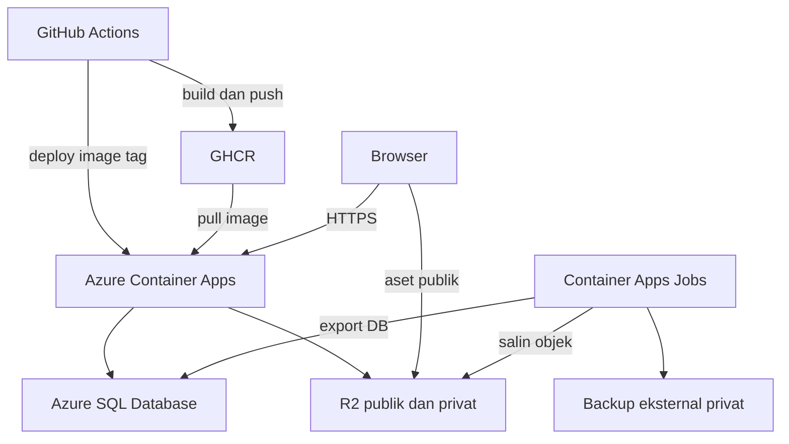

# PRD — Website PMII Rayon Saintek
**Product Requirements Document**
Version 1.6 | Laravel + Livewire | Azure Container Apps + Azure SQL Database + Cloudflare R2
Tanggal revisi: 7 Oktober 2026

> **Revisi v1.1** — menindaklanjuti review v1.0. Perubahan utama: hak akses per peran, kebijakan privasi & penghapusan data, arsip lintas periode, prosedur pergantian pengurus, backup & pemulihan, pengelolaan konten Tentang/Kontak lewat CMS, kriteria selesai per fitur, penyelarasan skema/rute, dan pembaruan versi Laravel serta keamanan upload/rich text. Tabel penelusuran ada di **Lampiran A**.
>
> **Revisi v1.2** — penyelarasan lanjutan: privasi foto sampai ke file asli (disk privat), persyaratan PHP/backup, `periode_id` & snapshot biro pada karya, cakupan `admin_biro` pada karya dan preview, pencegahan duplikasi BPH, aturan `published_at`, serta alur pemasangan pertama dan *empty state*. Penelusuran ada di **Lampiran C**.
>
> **Revisi v1.3** — periode untuk `admin_biro` saat membuat vs mengedit, pemeriksaan karya pada penghapusan periode, syarat backup yang konsisten (otomatis harian), akses foto `admin_biro`, penyelarasan baris Image Storage, dan **koreksi aturan versi `spatie/laravel-backup`** (v1.2 keliru: v9 tidak mendukung Laravel 13). Penelusuran ada di **Lampiran D**.
>
> **Revisi v1.4** — kriteria hosting dan backup dibedakan per **metode**: Metode A (paket Spatie) dan Metode B (backup otomatis milik hosting), sehingga hosting yang memenuhi Metode B tidak dianggap gagal. Penelusuran ada di **Lampiran E**.
>
> **Revisi v1.5** — arsitektur ditetapkan menjadi GitHub Actions + GitHub Container Registry (GHCR), Azure Container Apps, Azure SQL Database (SQL Server), dan Cloudflare R2. Skema, privasi file, CI/CD, sesi, backup, pengelolaan kuota, serah terima, dan kriteria selesai diselaraskan. Penelusuran ada di **Lampiran F**.
>
> **Revisi v1.6** — menambahkan Pembina di atas BPH pada halaman kepengurusan. Pembina dapat berasal dari anggota/alumni maupun orang luar, tanpa subjabatan. Profil dan penempatan per periode dipisahkan; CMS, privasi foto/keterangan, arsip, penghapusan, dan kriteria selesai diselaraskan. Penelusuran ada di **Lampiran G**.
>
> **Ketentuan yang berlaku:** bagian 4–11 versi ini menggantikan ketentuan teknis versi sebelumnya. Lampiran A, C, D, E, dan F merupakan riwayat revisi, bukan persyaratan implementasi tersendiri. Fitur organisasi dan batas V1 tetap mengikuti bagian 3, 4, 6, dan 12.

---

## 1. Overview & Visi Produk

### 1.1 Latar Belakang

PMII (Pergerakan Mahasiswa Islam Indonesia) Rayon Saintek membutuhkan sebuah platform digital yang mencerminkan identitas organisasi: intelektual, modern, dan berbasis komunitas. Website ini berfungsi sebagai wajah publik organisasi sekaligus sistem manajemen internal yang memudahkan pengurus dalam mengelola data anggota, struktural kepengurusan, dokumentasi kegiatan, dan publikasi karya anggota.

### 1.2 Tujuan Produk

- Membangun **kehadiran digital resmi** PMII Rayon Saintek yang prestisius dan modern.
- Menyediakan **CMS (Content Management System)** berbasis admin untuk mengelola seluruh konten secara mandiri tanpa keahlian teknis tinggi.
- Menjadi **arsip digital** yang terdokumentasi untuk kepengurusan, kegiatan, dan karya anggota lintas periode.
- Memperkenalkan PMII Rayon Saintek kepada publik luas khususnya mahasiswa baru.

### 1.3 Target Pengguna

| Segmen | Deskripsi |
|---|---|
| **Pengunjung Umum** | Mahasiswa, alumni, masyarakat umum yang ingin mengenal PMII Rayon Saintek |
| **Anggota PMII** | Anggota aktif yang ingin melihat profil, karya rekan, dan dokumentasi kegiatan |
| **Admin / Pengurus** | Pengurus BPH/redaksi yang mengelola seluruh konten melalui CMS (peran `admin`) |
| **Admin Biro** | Pengurus biro yang hanya mengelola konten biro sendiri (peran `admin_biro`) |
| **Super Admin** | Pengelola sistem tertinggi: pengguna, periode aktif, penghapusan permanen, backup (peran `super_admin`) |

---

## 2. Design System

> Bagian 2.2–2.6 pada PRD ini menjadi acuan implementasi visual **Institutional Humanism**.

### 2.1 Filosofi Desain

**Institutional Humanism** — Keseimbangan antara otoritas akademik dan energi komunitas berbasis grassroots. Desain menggunakan pendekatan hybrid **Minimalism + Glassmorphism** untuk menciptakan kesan ringan, modern, dan prestisius.

### 2.2 Color Palette

```css
/* === PRIMARY === */
--color-primary:           #002068; /* Deep Navy — struktur, navigasi, heading utama */
--color-primary-container: #003399; /* Royal Blue — CTA primer, background section penting */
--color-on-primary:        #ffffff;
--color-on-primary-container: #8aa4ff;

/* === SECONDARY (AKSEN EMAS) === */
--color-secondary:           #705d00;
--color-secondary-container: #fcd400; /* Gold — aksen CTA, highlight, badge aktif */
--color-on-secondary:        #ffffff;
--color-on-secondary-container: #6e5c00;

/* === SURFACE === */
--color-surface:                  #f8f9ff;
--color-surface-container-lowest: #ffffff;
--color-surface-container-low:    #eff4ff;
--color-surface-container:        #e5eeff;
--color-surface-container-high:   #dce9ff;
--color-surface-container-highest:#d3e4fe;

/* === TEXT === */
--color-on-surface:         #0b1c30; /* Teks utama */
--color-on-surface-variant: #444653; /* Teks sekunder, keterangan */

/* === BORDER === */
--color-outline:         #747684;
--color-outline-variant: #c4c5d5;

/* === STATE === */
--color-error:            #ba1a1a;
--color-error-container:  #ffdad6;
--color-background:       #f8f9ff;
```

### 2.3 Tipografi

```css
/* Import di <head> */
/* Google Fonts: Noto Serif (400, 600, 700) + Plus Jakarta Sans (400, 500, 600) */

/* === HEADLINE — Noto Serif === */
--font-serif: 'Noto Serif', Georgia, serif;

/* Display Large: hero section, nama organisasi */
--text-display-lg: 700 48px/1.2 var(--font-serif);
letter-spacing: -0.02em;

/* Headline Large: judul halaman, judul section */
--text-headline-lg: 600 32px/1.3 var(--font-serif);

/* Headline Medium: judul kartu, sub-section */
--text-headline-md: 600 24px/1.4 var(--font-serif);

/* === BODY — Plus Jakarta Sans === */
--font-sans: 'Plus Jakarta Sans', system-ui, sans-serif;

/* Body Large: teks artikel, deskripsi panjang */
--text-body-lg: 400 18px/1.6 var(--font-sans);

/* Body Medium: teks umum, label form */
--text-body-md: 400 16px/1.6 var(--font-sans);

/* Label Small: chip, tag, badge, caption */
--text-label-sm: 600 12px/1.0 var(--font-sans);
letter-spacing: 0.05em;
```

### 2.4 Spacing & Layout

```
Unit dasar: 4px
xs  = 0.5rem  (8px)   — padding kecil, gap ikon
md  = 1rem    (16px)  — padding standar komponen
lg  = 2rem    (32px)  — section padding internal
xl  = 4rem    (64px)  — antar section besar
gutter        = 1.5rem

Margin desktop: 5rem (80px) kiri-kanan
Margin mobile:  1rem (16px) kiri-kanan
Grid: 12 kolom desktop, fluid mobile
```

### 2.5 Elevation & Glassmorphism

```css
/* Glass Panel — komponen utama: kartu, modal, navbar sticky */
.glass-panel {
  background: rgba(255, 255, 255, 0.75);
  backdrop-filter: blur(16px);
  -webkit-backdrop-filter: blur(16px);
  border: 1px solid rgba(255, 255, 255, 0.2);
  border-radius: 1rem; /* rounded-lg */
  box-shadow: 0 8px 40px -8px rgba(0, 32, 104, 0.10);
}

/* Elevated Glass — modal, dropdown overlay */
.glass-elevated {
  background: rgba(255, 255, 255, 0.85);
  backdrop-filter: blur(24px);
  border: 1px solid rgba(255, 255, 255, 0.25);
  box-shadow: 0 16px 60px -12px rgba(0, 32, 104, 0.14);
}

/* Ambient shadow — efek mengambang */
box-shadow: 0 30px 80px -10px rgba(0, 32, 104, 0.08);
```

### 2.6 Komponen UI

#### Buttons
```
Primary   : bg #fcd400 | text #002068 | hover: shadow lg
Secondary : border 2px #002068 | text #002068 | hover: bg #002068 text white
Glass     : glass-panel | text #002068 | hover: scale(1.02)
Danger    : bg #ba1a1a | text white
```

#### Cards
```
Struktur  : glass-panel
Header    : Noto Serif (font-serif)
Content   : Plus Jakarta Sans (font-sans)
Hover     : transform scale(1.02) | transition 300ms ease
```

#### Input & Form
```
Background  : #f8f9ff
Border      : 1px solid #c4c5d5
Radius      : 0.5rem (8px)
Focus       : border #003399 + box-shadow 0 0 0 3px rgba(0,51,153,0.15)
```

#### Chips & Tags
```
Struktur  : pill-shape (border-radius: 9999px)
Fill      : rgba(0, 32, 104, 0.08)
Text      : #002068 | font: label-sm
Contoh    : "Artikel", "Puisi", "Biro Keilmuan"
```

---

## 3. Arsitektur Informasi

### 3.1 Struktur URL Publik

```
/                              → Landing Page
/tentang                       → Tentang PMII Rayon Saintek (sejarah, visi-misi, deskripsi; dikelola CMS)
/kepengurusan                  → Kepengurusan periode aktif
/kepengurusan/{periode-slug}   → Kepengurusan by periode, mis. /kepengurusan/2024-2025
/biro                          → Daftar biro aktif
/biro/{slug}                   → Profil & kegiatan biro (biro nonaktif tetap bisa dibuka lewat URL)
/kegiatan                      → Semua dokumentasi kegiatan (bisa filter periode & biro)
/kegiatan/{slug}               → Detail kegiatan
/karya                         → Semua karya anggota
/karya/{slug}                  → Detail karya
/karya?type=artikel            → Filter by tipe
/kontak                        → Halaman kontak (dikelola CMS)

/* Teknis */
/media/anggota/{id}            → Foto anggota; dilayani controller, 404 bila tanpa izin publikasi (lihat 4.2)
/media/pembina/{id}            → Foto Pembina; controller privat dengan pemeriksaan izin/penempatan (4.2.2)
```

> **Keputusan V1:** `/anggota` (daftar anggota publik) **dihapus dari V1**, dan tidak ada halaman profil anggota publik. Alasannya: data anggota memuat NIM, no. HP, dan email (lihat 4.2). Nama penulis pada karya tampil sebagai teks biasa tanpa tautan profil. Halaman profil anggota dapat dipertimbangkan di V2 dengan persetujuan anggota.

> Konten berstatus `draft` atau yang sudah dihapus (soft delete) **harus mengembalikan 404** bila diakses langsung lewat URL publik. Hal yang sama berlaku untuk URL foto anggota tanpa izin publikasi.

### 3.2 Struktur URL Admin (CMS)

```
/admin                         → redirect ke /admin/dashboard (atau /admin/login jika belum auth)
/admin/login                   → Login admin
/admin/dashboard               → Dashboard

/* Manajemen Anggota */
/admin/anggota                 → List anggota
/admin/anggota/create          → Tambah anggota
/admin/anggota/{id}/edit       → Edit anggota

/* Manajemen Kepengurusan */
/admin/periode                 → List periode kepengurusan
/admin/periode/create          → Tambah periode baru
/admin/periode/{id}/edit       → Edit periode
/admin/periode/{id}/pengurus   → Kelola pengurus pada periode tertentu
/admin/kepengurusan            → List struktural periode aktif

/* Manajemen Biro */
/admin/biro                    → List biro
/admin/biro/create             → Tambah biro
/admin/biro/{id}/edit          → Edit biro

/* Manajemen Kegiatan */
/admin/kegiatan                → List kegiatan
/admin/kegiatan/create         → Tambah kegiatan
/admin/kegiatan/{id}/edit      → Edit kegiatan
/admin/kegiatan/{id}/preview   → Preview draft (hanya user login)

/* Manajemen Karya */
/admin/karya                   → List karya
/admin/karya/create            → Tambah karya
/admin/karya/{id}/edit         → Edit karya
/admin/karya/{id}/preview      → Preview draft (hanya user login)

/* Sistem */
/admin/users                   → List user admin (super admin only)
/admin/settings                → Pengaturan website & konten halaman (lihat 6.7)
/admin/riwayat                 → Riwayat perubahan konten (admin & super admin)
/admin/ganti-password          → Ganti password sendiri
```

> Registrasi publik bawaan Breeze (`/register`) **dinonaktifkan**. Akun admin hanya dibuat oleh super admin.

---

## 4. Hak Akses & Kebijakan Data

### 4.1 Peran & Matriks Kewenangan

Tiga peran pada `users.role`: `super_admin`, `admin`, `admin_biro`. Pada `admin_biro`, kolom `users.biro_id` wajib terisi dan membatasi cakupannya.

| Fitur | super_admin | admin | admin_biro |
|---|:-:|:-:|:-:|
| Lihat dashboard | ✔ | ✔ | ✔ (statistik bironya) |
| Anggota: lihat | ✔ | ✔ | ✔ (tanpa NIM, HP, email, dan foto tanpa izin publikasi) |
| Anggota: tambah/edit/ubah status | ✔ | ✔ | ✘ |
| Anggota: hapus (soft delete) | ✔ | ✘ | ✘ |
| Biro: tambah/edit/nonaktifkan | ✔ | ✔ | ✘ (edit deskripsi biro sendiri saja) |
| Periode: tambah/edit | ✔ | ✔ | ✘ |
| Ubah `periode_id` pada kegiatan/karya yang sudah ada | ✔ | ✔ | ✘ |
| Periode: **jadikan aktif** | ✔ | ✘ | ✘ |
| Kepengurusan: tambah/edit/hapus pengurus | ✔ | ✔ | ✘ |
| Pembina: tambah/edit profil & kelola penempatan per periode | ✔ | ✔ | ✘ |
| Pembina: hapus profil yang belum digunakan | ✔ | ✔ | ✘ |
| Kegiatan: tambah/edit | ✔ semua | ✔ semua | ✔ hanya `biro_id` sendiri (tidak bisa membuat kegiatan tingkat rayon) |
| Kegiatan: publish/unpublish | ✔ | ✔ | ✔ hanya bironya |
| Kegiatan: hapus (soft delete) | ✔ | ✔ | ✘ |
| Karya: tambah/edit | ✔ semua | ✔ semua | ✔ hanya draft buatannya sendiri; `biro_id` terkunci ke biro akunnya |
| Karya: **publish**, set Karya Pilihan | ✔ | ✔ | ✘ (mengajukan sebagai draft) |
| Karya: hapus (soft delete) | ✔ | ✔ | ✘ |
| Preview draft | ✔ semua | ✔ semua | ✔ per objek: karya draft buatannya sendiri & kegiatan bironya |
| Hapus permanen konten (karya/kegiatan/foto) | ✔ | ✘ | ✘ |
| Settings & konten Tentang/Kontak | ✔ | ✔ | ✘ |
| Kelola user admin | ✔ | ✘ | ✘ |
| Lihat riwayat perubahan | ✔ | ✔ | ✘ |
| Backup & pemulihan | ✔ | ✘ | ✘ |

Aturan penegakan:
- Kewenangan dicek di **server** (Laravel Policy/Gate), bukan hanya dengan menyembunyikan tombol di UI.
- Percobaan tindakan di luar kewenangan mengembalikan **403** dan tercatat di riwayat.
- Hanya akun dengan `is_active = true` yang bisa login.
- Pembina adalah posisi struktural, bukan peran pada `users.role`; penempatan sebagai Pembina tidak membuat akun atau memberikan akses CMS secara otomatis.

**Cakupan `admin_biro` secara rinci**
- **Kegiatan:** `biro_id` terkunci ke biro akunnya (tidak ada pilihan lain, tidak boleh kosong). `periode_id` mengikuti aturan periode di bawah.
- **Karya:** `biro_id` **terkunci** ke biro akunnya pada saat membuat maupun mengedit, sehingga tidak bisa diisi kosong atau biro lain. `periode_id` mengikuti aturan periode di bawah. Ia hanya bisa mengedit karya yang **berstatus draft dan `created_by` = dirinya**; karya yang sudah published hanya bisa diedit `admin` / `super_admin`. Karya yang di-unpublish kembali ke draft dapat diedit lagi oleh pembuatnya.
- **Periode:** saat **membuat** kegiatan/karya, `periode_id` otomatis = periode aktif dan tidak dapat diubah; jika belum ada periode aktif, pembuatan diblokir dan `admin_biro` diarahkan menghubungi admin. Saat **mengedit** (termasuk draft lama), `periode_id` pada record **dipertahankan apa adanya**, ditampilkan baca-saja, dan nilai periode dari form diabaikan server, meskipun periode aktif sudah berganti. Mengubah periode sebuah record hanya oleh `admin` / `super_admin`.
- **Preview** (`/admin/karya/{id}/preview`, `/admin/kegiatan/{id}/preview`) mengikuti izin **per objek** lewat Policy (`view` pada draft): `admin` dan `super_admin` boleh semua; `admin_biro` hanya karya draft buatannya sendiri dan kegiatan bironya. Selain itu 403, dan tercatat di riwayat.
- Pengecekan dilakukan di server pada setiap aksi simpan; nilai `biro_id`/`periode_id` dari form tidak dipercaya. Akun yang dinonaktifkan saat sedang login otomatis keluar pada request berikutnya.

### 4.2 Privasi Data Anggota

| Data | Status | Aturan |
|---|---|---|
| NIM, no. HP, email | **Internal** | Tidak pernah tampil di halaman publik, OG tag, maupun sitemap. Hanya terlihat oleh `super_admin` dan `admin`. |
| Nama lengkap, jabatan, biro, periode (pengurus) | **Publik** | Melekat pada status pengurus; ditampilkan di halaman kepengurusan. |
| Foto dan bio | **Publik bersyarat** | Tampil hanya jika `anggota.setuju_publikasi = true`. Jika tidak, tampil avatar inisial **dan file fotonya tidak dapat diakses lewat URL langsung** (lihat 4.2.1). Persetujuan dicatat (`setuju_publikasi_at`). |
| Nama penulis pada karya | **Publik** | Mengikuti aturan tampilan penulis (6.3). Admin memastikan penulis setuju sebelum karya dipublikasikan. |
| Statistik (total anggota aktif, dll.) | **Publik (agregat)** | Hanya angka, tanpa identitas. |

- Foto yang diunggah diproses ulang (re-encode) sehingga metadata EXIF (termasuk koordinat GPS) terhapus.
- Anggota berhak meminta foto/bio-nya ditarik dari publik; admin menonaktifkan `setuju_publikasi` tanpa menghapus data lain.
- File backup memuat data pribadi sehingga aksesnya dibatasi (lihat bagian 10).

#### 4.2.1 Privasi sampai ke objek foto di R2

Penyimpanan menggunakan dua disk Laravel berbasis S3-compatible dan **dua bucket R2 terpisah**: `r2_public` untuk aset publik dan `r2_private` untuk foto anggota serta Pembina. Nama bucket aktual dicatat di Lampiran B; nama disk merupakan kontrak aplikasi.

- Seluruh foto anggota, termasuk file asli yang sudah diproses ulang dan semua varian resize, berada di **bucket privat**. Bucket ini tidak memiliki akses publik melalui custom domain maupun `r2.dev`; tidak ada salinan foto anggota di bucket publik.
- Database menyimpan **object key**, misalnya `anggota/{id}/{nama-acak}.webp`, bukan URL publik, kredensial, atau presigned URL.
- Foto dilayani melalui controller `/media/anggota/{id}` yang memeriksa izin **setiap request**, lalu mengambil/stream objek R2 menggunakan kredensial server:
  - Pengunjung: hanya 200 jika `setuju_publikasi = true`, anggota tidak soft-deleted, dan objek foto tersedia; selain itu **404**.
  - `admin` dan `super_admin` yang login boleh melihat foto tanpa izin publikasi untuk kebutuhan CMS. `admin_biro` mengikuti aturan pengunjung: foto tanpa izin → avatar inisial dan 404.
  - Controller tidak memberikan URL R2 privat/presigned GET kepada browser. Pencabutan izin menutup akses controller pada request berikutnya tanpa memindahkan objek.
  - Respons untuk pengguna login serta respons tanpa izin memakai `Cache-Control: no-store`. Foto berizin untuk pengunjung boleh memakai cache browser privat paling lama 1 jam. Rute `/media/anggota/*` melewati cache CDN bersama; salinan yang telah tersimpan di browser dapat bertahan sampai cache tersebut habis.
- Foto anggota tidak menjadi OG image, tidak masuk sitemap, dan tidak ditampilkan melalui URL selain controller di atas.
- Logo, favicon, hero, thumbnail, gambar rich text, dan galeri kegiatan berada di `r2_public`. Bucket publik memakai custom domain organisasi untuk produksi; `r2.dev` hanya untuk pengembangan. Admin memastikan persetujuan orang yang dapat dikenali sebelum publikasi galeri.
- Kredensial R2 hanya tersedia di runtime server/job; tidak dikirim dalam HTML, respons Livewire, atau JavaScript browser. CORS diatur sesuai kebutuhan browser dan domain yang digunakan, sedangkan izin foto tetap ditegakkan oleh controller.
- Kedua bucket termasuk cakupan backup bagian 10. File sementara upload dibersihkan dan tidak dihitung sebagai arsip organisasi.

#### 4.2.2 Privasi Data Pembina

- Nama lengkap, label **Pembina**, dan periode ditampilkan publik. Foto serta keterangan singkat hanya tampil bila `pembina.setuju_publikasi = true`; waktu persetujuan dicatat pada `setuju_publikasi_at`. Pencabutan izin menyembunyikan foto/keterangan pada seluruh periode, termasuk arsip.
- Relasi `anggota_id` bersifat internal. Foto, keterangan, dan persetujuan profil Pembina dikelola tersendiri; tidak otomatis menyalin foto atau persetujuan anggota yang terhubung.
- Seluruh foto Pembina dan variannya disimpan di `r2_private`, dengan object key `pembina/{id}/{nama-acak}.webp`, bukan URL. File diproses ulang untuk menghapus EXIF dan dilayani hanya melalui controller `/media/pembina/{id}`.
- Pengunjung hanya mendapat 200 jika Pembina memiliki penempatan pada suatu periode, izin publikasi aktif, dan objek foto tersedia; selain itu 404. `admin`/`super_admin` yang login boleh melihat foto untuk CMS, sedangkan `admin_biro` mengikuti izin pengunjung.
- Controller tidak memberikan URL R2 privat/presigned GET. Respons login/tanpa izin memakai `Cache-Control: no-store`; respons pengunjung berizin boleh memakai cache browser privat maksimal 1 jam. `/media/pembina/*` melewati cache CDN bersama. Pencabutan izin menutup akses pada request berikutnya, dengan batas cache browser yang sama seperti 4.2.1.
- Foto Pembina tidak menjadi OG image atau masuk sitemap. Placeholder inisial tampil bila foto kosong/tidak diizinkan. Pembina boleh meminta penarikan foto/keterangan tanpa menghapus penempatan periode. Backup kedua bucket mencakup foto Pembina.

### 4.3 Aturan Penghapusan & Pengarsipan

Prinsip: **arsip organisasi tidak boleh hilang karena pembersihan data.** Sebagian besar objek diarsipkan/dinonaktifkan, bukan dihapus.

| Objek | Tindakan normal | Boleh dihapus? | Efek pada data terkait |
|---|---|---|---|
| **Anggota** | Ubah `status` ke `alumni` / `non-aktif` | Soft delete (`deleted_at`) hanya oleh super_admin, **dan hanya jika** belum punya kepengurusan, karya, akun user, atau profil Pembina yang terhubung. Selain itu ditolak. | Alumni tetap tampil di kepengurusan periode lamanya dan tetap tercantum sebagai penulis karyanya. |
| **Biro** | Nonaktifkan (`is_aktif = false`) | Tidak boleh dihapus bila punya kepengurusan, kegiatan, karya, atau akun user yang terhubung. | Biro nonaktif hilang dari grid `/biro` & landing, tetapi arsipnya tetap ada. Nama biro pada arsip memakai snapshot (4.4). |
| **Periode** | — | Tidak boleh dihapus bila masih punya **penempatan Pembina, kepengurusan, kegiatan, atau karya**. Periode aktif tidak bisa dihapus. Pesan penolakan menyebut jumlah masing-masing, mis. *"Periode ini tidak dapat dihapus: 2 pembina, 12 pengurus, 5 kegiatan, 8 karya."* | — |
| **Profil Pembina** | Pertahankan profil yang digunakan dalam arsip | Admin/super_admin boleh menghapus hanya bila belum memiliki penempatan pada periode mana pun; jika digunakan, ditolak dengan jumlah periode terkait. | Penghapusan profil yang belum digunakan juga membersihkan foto privatnya; tidak menghapus anggota yang terhubung. |
| **Penempatan Pembina** | Pertahankan sebagai arsip periode | Admin/super_admin boleh melepas penempatan untuk koreksi salah input; tercatat di riwayat. | Tidak menghapus profil Pembina maupun penempatannya di periode lain. |
| **Pengurus (kepengurusan)** | Hapus baris kepengurusan | Boleh (koreksi salah input) oleh admin/super_admin; tercatat di riwayat. | Tidak mengubah data anggota. |
| **Kegiatan, Karya** | Ubah ke `draft` (unpublish) | Soft delete oleh admin/super_admin. Hapus permanen hanya super_admin. | Objek foto galeri baru dihapus dari R2 saat hapus permanen. |
| **Akun admin** | Nonaktifkan (`is_active = false`) | Hanya jika tidak direferensikan oleh konten (`created_by`/`updated_by`) atau riwayat aktivitas; selain itu cukup dinonaktifkan. | Konten buatannya tetap ada. `created_by` memakai foreign key `ON DELETE NO ACTION` pada SQL Server. |
| **Super admin terakhir** | — | **Tidak boleh** dihapus, dinonaktifkan, atau diturunkan perannya. | Sistem menolak aksi ini. |

### 4.4 Arsip Lintas Periode

- **Kegiatan terikat periode.** Setiap kegiatan memiliki `periode_id` (wajib). Default saat membuat kegiatan = periode aktif; dapat diubah untuk mengarsipkan kegiatan lama.
- **Karya terikat periode.** Setiap karya memiliki `periode_id` (wajib; default periode aktif, dapat diubah admin untuk mengarsipkan karya lama). Dipakai untuk label periode pada profil biro dan detail karya.
- **Snapshot nama biro.** `kepengurusan.biro_nama`, `kegiatan.biro_nama`, dan `karya.biro_nama` menyimpan nama biro saat relasi ditetapkan. Snapshot diisi ulang hanya ketika `biro_id` pada record itu diganti, **bukan** ketika nama biro diedit. Mengganti nama atau menonaktifkan biro **tidak mengubah** tampilan arsip lama. Halaman arsip menampilkan snapshot, sedangkan tautan tetap mengarah ke `slug` biro.
- **Slug stabil.** Slug biro, kegiatan, karya, dan periode tidak otomatis berubah saat judul/nama diedit setelah dipublikasikan.
- **Pergantian periode aktif tidak menghapus apa pun.** Mengaktifkan periode baru hanya memindahkan penanda `is_aktif`; semua kepengurusan dan kegiatan periode lama tetap dapat dibuka lewat `/kepengurusan/{periode-slug}` dan filter periode di `/kegiatan`.
- **Pembina terikat periode melalui `periode_pembina`.** Profil yang sama bisa dipakai lintas periode tanpa input ulang. Arsip menampilkan Pembina yang ditempatkan pada periode tersebut, bukan Pembina periode aktif. Nama/foto/keterangan memakai profil terkini (tidak memakai snapshot); pergantian periode tidak menghapus penempatan lama dan aturan izin publikasi tetap berlaku.
- **Profil biro** menampilkan pengurus periode aktif, serta kegiatan dan karya biro lintas periode (diberi label periode).

### 4.5 Pergantian Pengurus & Serah Terima Akses

Aturan sistem:
- Selalu harus ada **minimal 1 super admin aktif**; disarankan 2 (primer dan cadangan).
- Pengguna tidak bisa mengubah peran atau status akunnya sendiri.
- Pemulihan password: lewat tautan reset email (butuh SMTP; ini pengecualian dari "notifikasi email otomatis" di Out of Scope). Jika SMTP tidak tersedia, super admin mengatur password sementara dan akun ditandai `must_change_password = true` sehingga pengguna wajib menggantinya saat login berikutnya.

Prosedur serah terima (checklist yang dijalankan super admin setiap pergantian kepengurusan):

1. Buat akun super admin baru (atau pastikan ada 2 super admin aktif) **sebelum** menonaktifkan yang lama.
2. Buat periode baru, isi Pembina (jika ada), BPH, dan pengurus biro, lalu **jadikan aktif** (hanya super admin).
3. Nonaktifkan akun pengurus lama (`is_active = false`); jangan dihapus.
4. Buat akun `admin` / `admin_biro` untuk pengurus baru dan tautkan ke data anggotanya.
5. Ganti password super admin dan perbarui kontak di settings.
6. Serahkan di luar aplikasi: akses repository/GHCR, resource Azure dan SQL, akun/bucket R2, domain/DNS, SMTP, lokasi backup, dan inventaris konfigurasi serta secrets runtime. Akses platform diberikan melalui collaborator/RBAC; kredensial akun pribadi tidak dibagikan.
7. Rotasi kredensial operasional yang perlu diganti; `APP_KEY` dipertahankan lintas deployment dan hanya dirotasi melalui prosedur terencana. Catat pemilik subscription student, masa benefit, serta penanggung jawab biaya dan kelanjutan hosting.
8. Catat tanggal serah terima dan nama penerima di dokumen internal organisasi.

### 4.6 Pemasangan Pertama & Kondisi Awal

#### Membuat super admin pertama
- Tidak ada halaman registrasi dan tidak ada kredensial bawaan di production.
- Super admin pertama dibuat lewat **perintah artisan** sekali jalan (mis. `php artisan app:buat-super-admin`) yang meminta nama, email, dan password secara interaktif. Perintah ini **menolak berjalan** bila sudah ada user `super_admin`.
- Jalankan perintah melalui sesi exec container yang berizin atau **Manual Container Apps Job** memakai image aplikasi dan konfigurasi SQL yang sama. Untuk job noninteraktif, masukkan `INITIAL_ADMIN_*` sebagai secrets sementara, jangan mencetak password, lalu lepaskan/hapus secrets tersebut setelah berhasil. Akun ditandai `must_change_password = true`.
- Job bootstrap dijalankan satu kali dengan satu eksekusi aktif. Pemeriksaan keberadaan super admin dilakukan di database dan tidak bergantung pada file dalam container.
- Seeder berisi data dummy **hanya berjalan di lokal/staging**. Seeder production hanya membuat kunci `settings` kosong.
- Segera setelah masuk, buat super admin kedua (cadangan), sesuai 4.5.

#### Urutan penyiapan awal (checklist super admin)
1. Isi **Settings**: nama rayon, tagline, deskripsi, kontak, logo (6.7).
2. Buat **biro**.
3. Buat **periode** pertama; isi **Pembina** bila ada (boleh orang luar), lalu **anggota** → **pengurus BPH/biro**.
4. **Jadikan periode aktif**.
5. Buat akun `admin` / `admin_biro`, lalu super admin kedua.
6. Jalankan **backup pertama** dan uji pemulihan (bagian 10).
7. Baru setelah itu mulai mengisi kegiatan dan karya.

#### Kondisi sebelum ada data
- **Belum ada periode:** form tambah **kegiatan** dan **karya** tidak dapat dipakai dan menampilkan pemberitahuan *"Buat periode terlebih dahulu"* dengan tombol ke `/admin/periode/create` (untuk `admin_biro`: *"Hubungi admin untuk membuat periode"*). Penambahan pengurus juga diarahkan ke pembuatan periode.
- **Ada periode tetapi belum ada yang aktif:** `admin` dan `super_admin` tetap bisa membuat kegiatan dan karya dengan kolom periode wajib dipilih manual. Untuk `admin_biro`, pembuatan baru diblokir dengan pesan *"Belum ada periode aktif. Hubungi admin."*; draft lama miliknya tetap bisa diedit dengan periode yang dipertahankan. Halaman publik kepengurusan menampilkan pesan dan pilihan periode yang ada.
- **Belum ada anggota:** dropdown penulis/pengurus menampilkan *"Belum ada anggota"* dengan tautan ke form tambah anggota.
- **Belum ada profil Pembina:** bagian Pembina di CMS menawarkan **"Tambah Profil Pembina"**; tidak membutuhkan data anggota. Profil boleh dibuat sebelum ada periode, tetapi penempatan wajib memilih periode yang sudah ada.
- **Dashboard admin** menampilkan panel *"Mulai dari sini"* berisi checklist di atas selama belum ada biro/periode aktif.

#### Tampilan publik saat data kosong

| Halaman / bagian | Perilaku |
|---|---|
| `/kegiatan` | Pesan *"Belum ada kegiatan."* |
| `/karya` | Pesan *"Belum ada karya."* |
| `/karya` atau `/kegiatan` dengan filter tanpa hasil | Pesan *"Tidak ada hasil untuk filter ini"* + tombol reset filter |
| `/biro` | Pesan *"Belum ada biro."* |
| `/kepengurusan` tanpa periode aktif | Pesan *"Belum ada kepengurusan aktif."*; jika ada periode lama, selector periode tetap ditampilkan |
| Bagian Pembina pada `/kepengurusan` atau `/kepengurusan/{periode-slug}` | Disembunyikan jika periode yang ditampilkan belum memiliki Pembina; BPH dan biro tetap tampil sesuai datanya |
| `/biro/{slug}` | Tiap sub-bagian punya pesan sendiri: *"Belum ada pengurus pada periode aktif"*, *"Belum ada kegiatan"*, *"Belum ada karya"* |
| `/tentang`, `/kontak` | Bagian yang kosong disembunyikan; bila seluruhnya kosong tampil *"Informasi akan segera dilengkapi."* |
| Landing page | Section Biro, Kegiatan, Karya Pilihan, dan Kepengurusan **disembunyikan** bila kosong; statistik tetap tampil (angka 0). Hero memakai gradient bawaan bila `hero_image` belum diunggah; logo diganti teks `nama_rayon`. |

---

## 5. Database Schema — SQL Server / Azure SQL

> Skema di bawah merupakan **kontrak data**, bukan skrip T-SQL lengkap. Implementasi memakai migration Laravel dengan koneksi `sqlsrv`, lalu diverifikasi pada SQL Server dan Azure SQL target. FK berjenis `BIGINT` dan konsisten dengan PK; `PK IDENTITY` berarti primary key `IDENTITY(1,1)`.

### 5.0 Aturan tipe data dan integritas

| Kebutuhan | Ketentuan SQL Server |
|---|---|
| ID | `BIGINT IDENTITY(1,1)`; tidak memakai tipe unsigned |
| Teks Unicode | `NVARCHAR(n)`; konten panjang `NVARCHAR(MAX)` |
| Tahun | `SMALLINT`, divalidasi sebagai tahun; bukan tipe `YEAR` |
| Boolean | `BIT`, nilai 0/1 |
| Waktu | `DATETIME2(0)` disimpan UTC; waktu ditampilkan dalam Asia/Jakarta. `tanggal` kegiatan tetap `DATE` |
| Pilihan terbatas | `VARCHAR(n)` + `CHECK (... IN (...))`, dengan validasi form yang sama |
| JSON | `NVARCHAR(MAX)` + `CHECK (kolom IS NULL OR ISJSON(kolom) = 1)`; cast array pada model |
| Foreign key | `ON DELETE NO ACTION` untuk relasi yang dilindungi; kebijakan hapus/arsip tetap mengikuti 4.3 |

`TIMESTAMP` T-SQL merupakan rowversion, sehingga tidak dipakai untuk `created_at`, `updated_at`, `deleted_at`, atau tanggal publikasi. Semua index unik dan CHECK di bawah harus dibuat di database, bukan hanya divalidasi oleh form. Teks opsional boleh NULL; string kosong email anggota dinormalisasi menjadi NULL.

### 5.1 Tabel `anggota`

```text
id                  BIGINT PK IDENTITY
nim                 NVARCHAR(20) UNIQUE NOT NULL       -- INTERNAL
nama_lengkap        NVARCHAR(150) NOT NULL
nama_panggilan      NVARCHAR(50) NULL
angkatan            SMALLINT NOT NULL
fakultas            NVARCHAR(100) NULL
prodi               NVARCHAR(100) NULL
no_hp               NVARCHAR(20) NULL                  -- INTERNAL
email               NVARCHAR(100) NULL                -- INTERNAL; unique filtered index
foto                NVARCHAR(255) NULL                -- object key r2_private (4.2.1)
bio                 NVARCHAR(MAX) NULL
status              VARCHAR(16) NOT NULL DEFAULT 'aktif'
setuju_publikasi    BIT NOT NULL DEFAULT 0
setuju_publikasi_at DATETIME2(0) NULL
deleted_at          DATETIME2(0) NULL
created_at          DATETIME2(0) NOT NULL
updated_at          DATETIME2(0) NOT NULL

CHECK(status IN ('aktif','alumni','non-aktif'))
```

Email yang terisi wajib unik, sementara banyak anggota boleh belum memiliki email. Migration menggunakan filtered unique index:

```sql
CREATE UNIQUE INDEX UQ_anggota_email_terisi
ON dbo.anggota(email)
WHERE email IS NOT NULL;
```

### 5.2 Tabel `periode`

```text
id              BIGINT PK IDENTITY
nama            NVARCHAR(100) NOT NULL               -- mis. 2024/2025
slug            NVARCHAR(120) UNIQUE NOT NULL        -- mis. 2024-2025
tahun_mulai     SMALLINT NOT NULL
tahun_selesai   SMALLINT NOT NULL
is_aktif        BIT NOT NULL DEFAULT 0
tema            NVARCHAR(255) NULL
deskripsi       NVARCHAR(MAX) NULL
created_at      DATETIME2(0) NOT NULL
updated_at      DATETIME2(0) NOT NULL
```

Hanya satu periode boleh aktif. Perpindahan status dilakukan dalam satu transaction, didukung filtered unique index berikut:

```sql
CREATE UNIQUE INDEX UQ_periode_aktif
ON dbo.periode(is_aktif)
WHERE is_aktif = 1;
```

### 5.3 Tabel `biro`

```text
id              BIGINT PK IDENTITY
nama            NVARCHAR(100) NOT NULL
slug            NVARCHAR(120) UNIQUE NOT NULL
deskripsi       NVARCHAR(MAX) NULL
logo            NVARCHAR(255) NULL                  -- object key r2_public
warna_aksen     VARCHAR(7) NULL                     -- hex
urutan          TINYINT NOT NULL DEFAULT 0
is_aktif        BIT NOT NULL DEFAULT 1
created_at      DATETIME2(0) NOT NULL
updated_at      DATETIME2(0) NOT NULL
```

### 5.4 Tabel `kepengurusan` (anggota × periode × posisi)

```text
id              BIGINT PK IDENTITY
anggota_id      BIGINT FK → anggota.id NOT NULL ON DELETE NO ACTION
periode_id      BIGINT FK → periode.id NOT NULL ON DELETE NO ACTION
biro_id         BIGINT FK → biro.id NULL ON DELETE NO ACTION
biro_nama       NVARCHAR(100) NULL                   -- snapshot
jabatan         NVARCHAR(100) NOT NULL
level           VARCHAR(16) NOT NULL
urutan          TINYINT NOT NULL DEFAULT 0
created_at      DATETIME2(0) NOT NULL
updated_at      DATETIME2(0) NOT NULL

CHECK(level IN ('bph','ketua_biro','anggota_biro'))
CHECK((level = 'bph' AND biro_id IS NULL)
   OR (level IN ('ketua_biro','anggota_biro') AND biro_id IS NOT NULL))
```

**Pencegahan duplikasi memakai dua filtered unique index.** Kolom turunan `biro_key` dari skema MySQL versi lama tidak dipakai. BPH yang sama ditolak, sementara jabatan anggota pada biro berbeda tetap diperbolehkan:

```sql
CREATE UNIQUE INDEX UQ_kepengurusan_bph
ON dbo.kepengurusan(anggota_id, periode_id, jabatan)
WHERE biro_id IS NULL;

CREATE UNIQUE INDEX UQ_kepengurusan_biro
ON dbo.kepengurusan(anggota_id, periode_id, jabatan, biro_id)
WHERE biro_id IS NOT NULL;
```

Jika fluent migration tidak menyediakan filtered index yang diperlukan, gunakan `DB::statement` T-SQL pada migration, beserta penghapusan index pada rollback. Aplikasi tetap memberi pesan validasi yang jelas; database menjadi jaminan terakhir.

### 5.4.1 Tabel `pembina` (profil mandiri)

Pembina dapat berasal dari anggota/alumni maupun orang luar. Relasi anggota opsional; orang luar tidak perlu dibuat sebagai anggota. Semua profil berlabel **Pembina**, tanpa kolom level/jabatan atau biro. Tabel `kepengurusan` tetap khusus BPH dan pengurus biro dengan CHECK yang sudah ada pada 5.4.

```text
id                      BIGINT PK IDENTITY
anggota_id              BIGINT FK → anggota.id NULL ON DELETE NO ACTION
nama_lengkap            NVARCHAR(150) NOT NULL
foto                    NVARCHAR(255) NULL       -- object key r2_private
keterangan              NVARCHAR(500) NULL       -- teks polos, opsional
setuju_publikasi         BIT NOT NULL DEFAULT 0
setuju_publikasi_at      DATETIME2(0) NULL
created_at              DATETIME2(0) NOT NULL
updated_at              DATETIME2(0) NOT NULL
```

- `nama_lengkap` selalu wajib dan merupakan nama tampilan profil Pembina; memilih anggota boleh mengisi awal nama, tetapi perubahan nama anggota tidak otomatis mengubah profil Pembina.
- Gunakan filtered unique index `UQ_pembina_anggota` pada `anggota_id WHERE anggota_id IS NOT NULL`: satu anggota tidak mempunyai profil Pembina ganda, sedangkan banyak profil orang luar boleh bernilai NULL. Nama tidak dibuat unique karena orang berbeda dapat bernama sama.
- Izin aktif wajib memiliki `setuju_publikasi_at`; waktu diisi server ketika persetujuan diberikan dan diisi ulang saat persetujuan diberikan kembali. Riwayat mencatat pemberian/pencabutan izin.

### 5.4.2 Tabel `periode_pembina` (penempatan per periode)

```text
id              BIGINT PK IDENTITY
pembina_id      BIGINT FK → pembina.id NOT NULL ON DELETE NO ACTION
periode_id      BIGINT FK → periode.id NOT NULL ON DELETE NO ACTION
urutan          TINYINT NOT NULL DEFAULT 0
created_at      DATETIME2(0) NOT NULL
updated_at      DATETIME2(0) NOT NULL

UNIQUE(pembina_id, periode_id)
```

Satu periode boleh memiliki nol atau banyak Pembina. Satu profil dapat dipakai di banyak periode. Duplikasi pasangan ditolak oleh validasi aplikasi dan unique constraint database, termasuk saat request bersamaan. Urutan tampil berdasarkan `urutan ASC`, lalu `id ASC` sebagai penentu jika urutan sama. Kedua FK tidak memakai cascade delete; pelepasan penempatan adalah tindakan eksplisit dan tercatat di riwayat.

### 5.5 Tabel `kegiatan`

```text
id              BIGINT PK IDENTITY
periode_id      BIGINT FK → periode.id NOT NULL ON DELETE NO ACTION
biro_id         BIGINT FK → biro.id NULL ON DELETE NO ACTION
biro_nama       NVARCHAR(100) NULL                   -- snapshot
judul           NVARCHAR(255) NOT NULL
slug            NVARCHAR(270) UNIQUE NOT NULL
deskripsi       NVARCHAR(MAX) NULL                  -- HTML tersanitasi
tanggal         DATE NOT NULL
lokasi          NVARCHAR(200) NULL
thumbnail       NVARCHAR(255) NULL                  -- object key r2_public
status          VARCHAR(16) NOT NULL DEFAULT 'draft'
published_at    DATETIME2(0) NULL                   -- publikasi pertama (6.6)
created_by      BIGINT FK → users.id NOT NULL ON DELETE NO ACTION
updated_by      BIGINT FK → users.id NULL ON DELETE NO ACTION
deleted_at      DATETIME2(0) NULL
created_at      DATETIME2(0) NOT NULL
updated_at      DATETIME2(0) NOT NULL

CHECK(status IN ('draft','published'))
```

### 5.6 Tabel `kegiatan_foto`

```text
id              BIGINT PK IDENTITY
kegiatan_id     BIGINT FK → kegiatan.id NOT NULL ON DELETE NO ACTION
path            NVARCHAR(255) NOT NULL              -- object key r2_public
caption         NVARCHAR(255) NULL
urutan          TINYINT NOT NULL DEFAULT 0
created_at      DATETIME2(0) NOT NULL
```

Batas: **20 foto per kegiatan**, **5 MB per file**, dan **40 MB per sekali simpan**. Penghapusan permanen menghapus relasi dan objek sesuai 4.3, dengan penanganan kegagalan R2 tanpa merusak referensi arsip lain.

### 5.7 Tabel `karya`

```text
id              BIGINT PK IDENTITY
penulis_tipe    VARCHAR(16) NOT NULL
anggota_id      BIGINT FK → anggota.id NULL ON DELETE NO ACTION
penulis_nama    NVARCHAR(150) NULL
periode_id      BIGINT FK → periode.id NOT NULL ON DELETE NO ACTION
biro_id         BIGINT FK → biro.id NULL ON DELETE NO ACTION
biro_nama       NVARCHAR(100) NULL                   -- snapshot
judul           NVARCHAR(255) NOT NULL
slug            NVARCHAR(270) UNIQUE NOT NULL
tipe            VARCHAR(16) NOT NULL
konten          NVARCHAR(MAX) NOT NULL              -- HTML tersanitasi
excerpt         NVARCHAR(255) NULL                  -- validasi maksimal 200 karakter
thumbnail       NVARCHAR(255) NULL                  -- object key r2_public
tags            NVARCHAR(MAX) NULL                  -- JSON array, model cast array
is_featured     BIT NOT NULL DEFAULT 0
status          VARCHAR(16) NOT NULL DEFAULT 'draft'
published_at    DATETIME2(0) NULL
created_by      BIGINT FK → users.id NOT NULL ON DELETE NO ACTION
updated_by      BIGINT FK → users.id NULL ON DELETE NO ACTION
deleted_at      DATETIME2(0) NULL
created_at      DATETIME2(0) NOT NULL
updated_at      DATETIME2(0) NOT NULL

CHECK(penulis_tipe IN ('anggota','nama_bebas','anonim','redaksi'))
CHECK(tipe IN ('artikel','esai','puisi','berita'))
CHECK(status IN ('draft','published'))
CHECK(tags IS NULL OR ISJSON(tags) = 1)
```

Kombinasi `penulis_tipe`, `anggota_id`, dan `penulis_nama` divalidasi mengikuti 6.3. `tags` divalidasi sebagai array string pada aplikasi; pemeriksaan JSON database tidak menggantikan validasi bentuk array.

### 5.8 Tabel `users` (admin CMS)

```text
id                    BIGINT PK IDENTITY
nama                  NVARCHAR(150) NOT NULL
email                 NVARCHAR(100) UNIQUE NOT NULL
password              NVARCHAR(255) NOT NULL
role                  VARCHAR(16) NOT NULL DEFAULT 'admin'
biro_id               BIGINT FK → biro.id NULL ON DELETE NO ACTION
anggota_id            BIGINT FK → anggota.id NULL ON DELETE NO ACTION
is_active             BIT NOT NULL DEFAULT 1
must_change_password  BIT NOT NULL DEFAULT 0
remember_token        NVARCHAR(100) NULL
created_at            DATETIME2(0) NOT NULL
updated_at            DATETIME2(0) NOT NULL

CHECK(role IN ('super_admin','admin','admin_biro'))
CHECK(role <> 'admin_biro' OR biro_id IS NOT NULL)
```

### 5.9 Tabel `settings`

```text
id              BIGINT PK IDENTITY
key             NVARCHAR(100) UNIQUE NOT NULL
value           NVARCHAR(MAX) NULL
created_at      DATETIME2(0) NOT NULL
updated_at      DATETIME2(0) NOT NULL
```

Kunci konten CMS ada di 6.7. Konfigurasi infrastruktur dan kredensial disimpan di runtime secrets, bukan di tabel settings yang dapat diedit admin.

### 5.10 Tabel `riwayat_aktivitas`

```text
id              BIGINT PK IDENTITY
user_id         BIGINT FK → users.id NULL ON DELETE NO ACTION
aksi            NVARCHAR(50) NOT NULL
subjek_tipe     NVARCHAR(50) NOT NULL
subjek_id       BIGINT NULL
ringkasan       NVARCHAR(255) NULL
perubahan       NVARCHAR(MAX) NULL                  -- JSON, tanpa password/token
created_at      DATETIME2(0) NOT NULL

CHECK(perubahan IS NULL OR ISJSON(perubahan) = 1)
```

Minimal mencatat **siapa, apa, kapan** untuk tindakan tulis pada konten, anggota, periode, user, dan settings. Password, token, dan connection string tidak masuk kolom `perubahan` maupun log aplikasi.

### 5.11 Tabel operasional dan urutan migration

- Tabel framework untuk `sessions`, `cache`, cache locks, dan reset password dibuat sesuai driver SQL Server yang digunakan; sesi/cache tidak disimpan sebagai data permanen pada filesystem container.
- Buat tabel dasar terlebih dahulu, lalu tambahkan foreign key `users.anggota_id`/`users.biro_id` dan relasi `created_by` setelah semua tabel tujuannya ada. Hindari siklus urutan pembuatan tabel.
- Index query publik menyesuaikan filter/status/periode/biro dan pagination; implementasi dipastikan melalui query aktual pada SQL Server.
- Pengujian integritas memakai SQL Server; hasil SQLite saja tidak cukup untuk membuktikan CHECK, filtered index, dan FK pada target deployment.

---

## 6. Core Features

### 6.1 Public — Landing Page

#### Hero Section
- Headline utama dengan nama organisasi (Display LG, Noto Serif)
- Sub-headline misi singkat
- Dua CTA: **"Kenali Kami"** (primary gold) dan **"Lihat Karya"** (secondary outline)
- Background: foto kegiatan organisasi dengan glassmorphic overlay gradient
- Animasi: fade-in staggered pada headline, sub-headline, CTA

#### Section: Tentang Rayon
- Deskripsi singkat PMII Rayon Saintek (dari settings `deskripsi_singkat`)
- Statistik agregat: total anggota **aktif** (tidak termasuk soft-deleted), jumlah biro **aktif**, jumlah kegiatan published, jumlah karya published
- Tombol **"Baca Selengkapnya"** ke `/tentang`

#### Section: Biro-Biro
- Grid kartu biro aktif (glass-panel)
- Setiap kartu: logo biro, nama, deskripsi singkat, CTA ke profil biro
- Hover: scale 1.02 + shadow intensify

#### Section: Kegiatan Terbaru
- 3 kartu kegiatan published terbaru (thumbnail, judul, biro, tanggal)
- Tombol **"Lihat Semua Kegiatan"**

#### Section: Karya Pilihan
- **Dipilih admin** lewat penanda `is_featured` pada karya published (maksimal 6).
- Jika yang ditandai kurang dari 4, sisanya diisi otomatis dengan karya published terbaru sampai genap 4–6 kartu.
- Kartu menampilkan chip tipe (Artikel, Puisi, dst.); layout masonry atau grid 2-kolom
- Tombol **"Jelajahi Semua Karya"**

#### Section: Kepengurusan Aktif (Teaser)
- Nama (dan foto jika `setuju_publikasi`) Ketua Umum & Wakil dari periode aktif
- Tombol **"Lihat Struktur Lengkap"**

#### Footer
- Logo + tagline
- Navigasi cepat
- Link sosial media
- Info kontak (email, WA, alamat) dari settings
- Copyright + nama rayon + tahun

---

### 6.2 Public — Halaman Kepengurusan

#### Selector Periode
- Dropdown/tab untuk memilih periode (default: aktif); URL berubah ke `/kepengurusan/{periode-slug}`
- Tampilkan tema periode jika ada

#### Pembina
- Urutan bagian halaman: **Pembina → BPH → Biro**. Ini urutan tampilan struktur, bukan tambahan peran akses CMS.
- Grid kartu untuk seluruh Pembina pada periode yang dipilih: nama lengkap, label tetap **Pembina**, foto dan keterangan singkat hanya jika diizinkan (4.2.2).
- Tidak ada Ketua Pembina, Anggota Pembina, atau subjabatan lainnya; semua kartu setara dan mengikuti urutan penempatan di `periode_pembina`.
- Jika belum ada penempatan, bagian Pembina disembunyikan. Foto kosong/tanpa izin diganti avatar inisial.

#### BPH (Badan Pengurus Harian)
- Layout grid kartu: foto (jika disetujui, selain itu avatar inisial), nama lengkap, jabatan
- Urutan berdasarkan field `urutan`
- Kartu BPH lebih menonjol (ukuran lebih besar atau warna berbeda)

#### Per-Biro
- Accordion atau tab per biro, memakai **nama biro snapshot** (`kepengurusan.biro_nama`)
- Tiap biro: Ketua Biro ditonjolkan, lalu grid anggota biro di bawahnya

---

### 6.3 Public — Halaman Karya

#### Filter & Pencarian
- Filter tipe: Semua / Artikel / Esai / Puisi / Berita
- Pencarian real-time by judul (Livewire)
- Sort: Terbaru / Terpopuler (opsional: view count)

#### Kartu Karya
- Thumbnail, tipe (chip), judul, penulis, tanggal terbit, excerpt 2 baris (excerpt maksimal 200 karakter)

#### Aturan Tampilan Penulis

| `penulis_tipe` | Syarat data | Tampil sebagai |
|---|---|---|
| `anggota` | `anggota_id` terisi, `penulis_nama` kosong | Nama lengkap anggota (teks biasa, tanpa tautan profil) |
| `nama_bebas` | `penulis_nama` terisi, `anggota_id` kosong | Teks pada `penulis_nama` |
| `anonim` | keduanya kosong | "Anonim" |
| `redaksi` | keduanya kosong | "Redaksi " + `settings.nama_rayon` |

Validasi form memastikan kombinasi di atas; kombinasi lain ditolak.

#### Detail Karya
- Konten full dari rich text (render HTML yang sudah disanitasi)
- Info: penulis (sesuai aturan di atas), tanggal terbit (`published_at`), tipe, periode, biro (memakai nama snapshot, jika ada)
- Karya terkait di bawah (tipe/biro/tag yang sama, maksimal 3)
- Karya `draft` atau terhapus → 404

---

### 6.4 Public — Halaman Kegiatan

#### List Kegiatan
- Filter by biro dan by periode
- Kartu: thumbnail, judul, biro (snapshot), tanggal, lokasi

#### Detail Kegiatan
- Deskripsi kegiatan
- Galeri foto (lightbox)
- Info: biro penyelenggara, periode, tanggal, lokasi
- Kegiatan `draft` atau terhapus → 404

---

### 6.5 Public — Halaman Profil Biro

- Nama biro, logo, deskripsi lengkap
- Pengurus biro **periode aktif** (Ketua + anggota)
- Kegiatan yang pernah dilakukan biro ini (lintas periode, berlabel periode)
- **Karya terkait biro**: karya published dengan `karya.biro_id` = biro ini
- Biro nonaktif tetap dapat dibuka lewat URL dengan label "Arsip" dan tanpa daftar pengurus aktif

---

### 6.6 Admin CMS

#### Dashboard
- Ringkasan statistik: total anggota, kepengurusan aktif, karya published, kegiatan
- Karya & kegiatan terbaru (5 item)
- Quick action: Tambah Karya, Tambah Kegiatan
- Untuk `admin_biro`, seluruh ringkasan dibatasi pada biro sendiri

#### CRUD Anggota
- Form: NIM, nama lengkap, nama panggilan, angkatan, fakultas, prodi, no HP, email, bio, foto, status, **izin publikasi foto & bio**
- Upload foto dengan preview
- Search & filter by angkatan, status, prodi
- Ubah status ke alumni/non-aktif sebagai cara utama "menghapus"; soft delete mengikuti aturan 4.3
- Kolom NIM/HP/email disembunyikan dari `admin_biro`

#### CRUD Periode & Kepengurusan
- Buat periode baru (nama, tahun mulai, tahun selesai, tema); slug dibuat otomatis (mis. `2024-2025`)
- **Jadikan aktif** (super_admin saja): hanya 1 periode aktif, dijalankan dalam satu DB transaction
- Di dalam periode: assign anggota → jabatan → level (BPH/Ketua Biro/Anggota Biro) → biro; nama biro disimpan sebagai snapshot
- Reorder urutan tampilan dengan drag (opsional) atau input angka

#### Kelola Pembina (di halaman Kelola Pengurus per Periode)
- Hanya `admin` dan `super_admin`; Policy/Gate menolak akses `admin_biro` (403).
- Kelola profil: nama lengkap wajib (maks. 150 karakter), relasi anggota/alumni opsional, foto opsional, keterangan teks polos opsional (maks. 500 karakter), serta izin publikasi foto/keterangan. Upload foto memakai batas format/ukuran dan re-encode yang sama dengan foto anggota, tetapi disk/key dan controller mengikuti 4.2.2.
- Pilih profil yang sudah ada atau buat profil baru langsung dari bagian Pembina, lalu tempatkan pada periode yang sedang dikelola. Tidak ada input subjabatan atau biro; label selalu **Pembina**.
- Daftar profil tersedia di bagian ini untuk mengedit profil yang belum ditempatkan maupun yang sudah digunakan. Perubahan nama/foto/keterangan memengaruhi semua periode yang menggunakan profil tersebut; CMS menjelaskan cakupan ini sebelum menyimpan.
- Atur `urutan` melalui input angka 0–255 atau drag opsional. Tolak profil yang sudah ditempatkan pada periode yang sama dengan pesan jelas.
- **Lepaskan dari periode** hanya menghapus penempatan pada periode itu; tidak menghapus profil atau penempatan periode lainnya. Penghapusan profil hanya boleh jika belum digunakan (4.3).
- Riwayat mencatat pembuatan/perubahan/penghapusan profil, izin publikasi, penambahan/pelepasan penempatan, dan perubahan urutan. Foto lama dibersihkan saat diganti/dihapus setelah penyimpanan profil berhasil.
- Seluruh pengelolaan berada dalam `/admin/periode/{id}/pengurus`; tidak memerlukan halaman publik profil Pembina atau menu utama baru. Perubahan ini tidak menambah statistik anggota atau memberi akses akun otomatis.

#### CRUD Biro
- Form: nama, slug (auto-generate; tidak berubah otomatis setelah dibuat), deskripsi, logo, warna aksen, urutan, status aktif
- List biro dengan tombol aksi; tombol "Hapus" hanya muncul bila memenuhi aturan 4.3, selain itu "Nonaktifkan"

#### CRUD Kegiatan
- Form: judul, slug (auto), **periode** (default periode aktif), biro (opsional), tanggal, lokasi, deskripsi (rich text), thumbnail
- Upload multiple foto galeri dengan caption (maks 20 foto, 5 MB per file, 40 MB per sekali simpan)
- Status: Draft / Published
- Preview sebelum publish lewat `/admin/kegiatan/{id}/preview`, dengan izin per objek (4.1)
- `published_at` kegiatan mengikuti aturan yang sama dengan karya (otomatis saat publikasi pertama, tidak berubah sesudahnya); tanggal kegiatan sebenarnya ada pada field `tanggal`

#### CRUD Karya
- Form: judul, slug (auto), tipe, **periode** (default periode aktif), **penulis (anggota / nama bebas / anonim / redaksi)**, **biro terkait (opsional; terkunci untuk `admin_biro`)**, konten (rich text editor), excerpt (maks 200 karakter), thumbnail, tags, status
- **Tanggal terbit:** tidak ada input manual di V1. `published_at` diisi otomatis saat **publikasi pertama** dan **tetap dipertahankan** ketika konten diedit, di-unpublish, atau diterbitkan ulang. Daftar publik diurutkan berdasarkan `published_at`. Karya yang belum pernah terbit memiliki `published_at` kosong.
- Penanda **Karya Pilihan** (`is_featured`) untuk admin/super_admin
- Filter: tipe, status, penulis, biro
- Bulk action: publish, draft, hapus (soft delete); bulk publish hanya untuk admin/super_admin
- Preview draft lewat `/admin/karya/{id}/preview`, dengan izin per objek (4.1)

#### Manajemen User Admin *(Super Admin only)*
- Tambah akun, edit, **nonaktifkan/aktifkan** (bukan hapus, lihat 4.3)
- Assign role: super_admin / admin / admin_biro (admin_biro wajib memilih biro)
- Link ke data anggota (opsional)
- Atur password sementara + `must_change_password`
- Sistem menolak menonaktifkan/menurunkan super admin terakhir

#### Riwayat Perubahan
- Daftar `riwayat_aktivitas`: waktu, pengguna, aksi, objek; filter by pengguna, objek, rentang tanggal
- Bersifat baca-saja; tidak ada fitur edit/hapus riwayat

---

### 6.7 Pengaturan Website & Konten Halaman (CMS)

Halaman `/admin/settings` dibagi tab. Semua nilai disimpan di tabel `settings`; field rich text disanitasi seperti konten lain (9.2).

| Tab | Kunci `settings` | Tipe input | Dipakai di |
|---|---|---|---|
| **Umum** | `nama_rayon`, `tagline`, `deskripsi_singkat` | teks | Navbar, hero, footer, landing |
| **Halaman Tentang** | `tentang_deskripsi` (deskripsi organisasi), `tentang_sejarah`, `visi`, `misi` | rich text (visi: teks) | `/tentang` |
| **Kontak & Sosmed** | `email_kontak`, `no_wa`, `alamat`, `peta_url` (tautan Google Maps, tanpa iframe), `sosmed_instagram`, `sosmed_youtube`, `sosmed_tiktok`, `sosmed_facebook`, `sosmed_x` | teks/URL | `/kontak`, footer |
| **Tampilan & SEO** | `logo`, `favicon`, `hero_image`, `og_image` | upload gambar | seluruh situs, OG tag |

- Perubahan settings tercatat di riwayat.
- Preview thumbnail social media (OG image) tersedia pada tab Tampilan & SEO.

---

## 7. Tech Stack, Arsitektur & Deployment

### 7.1 Stack Utama

| Layer | Teknologi / keputusan |
|---|---|
| Backend | Laravel 13.x; target image **PHP 8.4**, minimum framework PHP 8.3 |
| Frontend | Livewire versi kompatibel + Tailwind CSS dengan token bagian 2 |
| Database | **Azure SQL Database (SQL Server)**; koneksi Laravel `sqlsrv` |
| Driver database | Ekstensi `sqlsrv`, `pdo_sqlsrv`, Microsoft ODBC Driver; versi dikunci dan diverifikasi pada image Linux |
| Rich text & sanitasi | TipTap/Quill + HTMLPurifier dengan allowlist 9.2 |
| Media | **Cloudflare R2**, disk S3-compatible `r2_public` dan `r2_private` |
| Authentication | Starter kit Laravel/Livewire yang kompatibel; email+password, tanpa registrasi publik |
| Session & cache bersama | Driver database; session, rate limit, dan lock tidak bergantung pada disk lokal replica |
| Source & CI/CD | Repository GitHub + **GitHub Actions** |
| Registry | **GHCR** (`ghcr.io/...`); image menggunakan tag commit SHA/digest |
| Runtime web | **Azure Container Apps, Consumption**, HTTP ingress HTTPS |
| Tugas operasional | **Azure Container Apps Jobs** untuk migration, bootstrap, dan backup terjadwal |
| Backup | Backup native Azure SQL + export DB eksternal otomatis + salinan kedua bucket R2 (bagian 10) |

Arsitektur tetap satu aplikasi Laravel + Livewire. Database, file permanen, dan image disimpan pada layanan masing-masing; file upload dan database tidak berada di filesystem lokal container web.



### 7.2 Kontrak Docker dan runtime

- Image Linux berisi PHP, ekstensi Laravel, driver SQL Server, dependensi Composer, dan hasil build frontend. Runtime HTTP menggunakan Nginx + PHP-FPM; port container ditetapkan konsisten, default 8080.
- Build memakai `composer.lock` dan lockfile frontend; dependensi pengembangan dan server Vite tidak menjadi runtime produksi. `config.platform.php` mengikuti PHP 8.4 pada image, bukan versi laptop.
- Web root menunjuk ke Laravel `public/`. Source, secrets, dan file sementara tidak menjadi URL publik.
- `.env`, kredensial, data produksi, dan backup tidak masuk repository atau Docker image. Secrets diberikan saat runtime. `APP_KEY` stabil lintas revision; `APP_ENV=production`, `APP_DEBUG=false`, `APP_URL` sesuai domain HTTPS.
- Filesystem container bersifat sementara. `storage`/`bootstrap/cache` tetap writable untuk kebutuhan runtime sementara, tetapi media final selalu berada di R2. Cache konfigurasi/route/view boleh lokal per revision setelah konfigurasi runtime tersedia.
- Session dan cache/lock bersama menggunakan SQL Server agar login dan pembatasan akses tetap konsisten saat revision berganti. Upload sementara harus dapat diselesaikan secara aman; jika terputus, pengguna bisa mengulang dan tidak tercipta record yang menunjuk objek final yang gagal tersimpan.
- Log aplikasi diarahkan ke stdout/stderr. Secret dan isi data pribadi tidak dicetak. Endpoint health dasar tidak membutuhkan query SQL atau panggilan R2 pada setiap probe.
- Default awal `minReplicas=0`, `maxReplicas=1` untuk penggunaan hemat. Konsekuensi cold start diukur (9.1); perubahan kapasitas dicatat di Lampiran B berdasarkan kebutuhan dan biaya.

### 7.3 Pipeline GitHub Actions → GHCR → Azure

| Tahap | Ketentuan |
|---|---|
| Pull request | Install dari lockfile, build frontend, pemeriksaan kode, dan automated test; test integritas dijalankan pada SQL Server |
| Build release | Setelah merge/push ke `main`, build image dan push ke GHCR dengan tag commit SHA; simpan digest sebagai identitas release |
| Migrasi | Jalankan **Manual Container Apps Job** satu kali per release memakai image/kode yang sama dan kredensial migration; tunggu exit code sukses |
| Deployment | Workflow meng-update image Container App ke tag/digest baru; push ke registry saja tidak memperbarui aplikasi |
| Verifikasi | Tunggu revision siap, lalu smoke check HTTP, login, dan akses media; jika gagal, release tidak dinyatakan berhasil |
| Rollback | Kembalikan traffic/image ke revision sehat sebelumnya, sesuai 7.7 |

- Workflow release diserialisasi agar dua deployment tidak berlomba menjalankan migration. Migration tidak dijalankan otomatis oleh setiap replica saat startup.
- Release/migration dan export backup memakai lock operasi bersama sehingga perubahan schema/data tidak berjalan ketika snapshot/export sedang berlangsung.
- Migration produksi harus kompatibel dengan revision yang masih melayani traffic; perubahan destruktif memakai tahap terpisah setelah data/backup aman dan revision lama tidak memerlukannya.
- GitHub Actions mengakses Azure melalui **OIDC/federated identity** dengan izin sebatas resource deployment yang diperlukan. Akses push GHCR memakai token workflow sesuai izin package.
- Jika image GHCR privat, Container App dikonfigurasi dengan kredensial pull berizin `read:packages` yang dapat dirotasi. Nama repo, pemilik package, dan visibilitas image dicatat di Lampiran B.
- Job operasional dapat memakai image aplikasi atau image ops berisi SqlPackage dan alat salin objek. Versi alat dan image job dikunci; job tidak memerlukan ingress publik.

### 7.4 Konfigurasi Azure SQL

- Resource yang dipilih adalah **Azure SQL Database**, bukan Azure Database for MySQL. Buat logical server, pilih region, lalu buat database dengan free offer yang telah diverifikasi.
- Konfigurasi utama: `DB_CONNECTION=sqlsrv`, host `<server>.database.windows.net`, port 1433, nama database, dan kredensial database sebagai secrets runtime. Koneksi terenkripsi dan sertifikat server diverifikasi.
- Pisahkan identitas/kredensial aplikasi untuk kebutuhan baca/tulis dari identitas migration/backup dengan izin operasionalnya. Web runtime tidak memakai kredensial admin server untuk kegiatan sehari-hari.
- Konektivitas Container Apps/Jobs ke SQL diuji dan dibatasi menggunakan opsi jaringan yang tersedia; pilihan private network atau firewall serta konsekuensi biayanya dicatat di Lampiran B. Database tidak dibuka ke semua alamat IP sebagai konfigurasi permanen.
- Semua migration, filtered index, CHECK, Unicode, dan operasi CRUD dibuktikan pada target SQL Server/Azure SQL sebelum fitur lain bergantung padanya.

### 7.5 Konfigurasi R2 dan alur upload

- Dua disk Laravel menggunakan driver S3-compatible, endpoint R2 akun terkait, region `auto`, nama bucket, dan API credentials dengan cakupan bucket yang diperlukan.
- `r2_public` memakai custom domain organisasi, misalnya `media.<domain-organisasi>`, untuk URL publik. `r2_private` tidak memiliki endpoint publik; foto mengikuti 4.2.1.
- V1 mengirim upload melalui Laravel untuk validasi, re-encode, resize, dan penghapusan EXIF sebelum objek final ditulis ke R2. Kredensial storage tidak diberikan kepada browser.
- Simpan object key pada kolom file; URL publik dibentuk dari konfigurasi disk/domain. Pergantian custom domain tidak mengharuskan perubahan setiap record.
- Penggantian file menyimpan objek baru terlebih dahulu, meng-update referensi database setelah upload berhasil, lalu membersihkan objek lama. Kegagalan disertai pesan untuk mengulang dan log operasional; tidak meninggalkan referensi ke file yang belum tersimpan.
- Pada kedua bucket, kebijakan cleanup file sementara terpisah dari objek arsip. Backup mingguan menyalin objek final yang dibutuhkan database.
- Jika ada akses browser yang memerlukan CORS, Allowed Origins diisi domain produksi/staging yang dipakai. Bucket privat tetap membutuhkan otorisasi walaupun CORS sudah dikonfigurasi.

### 7.6 Jadwal tugas operasional

| Tugas | Bentuk eksekusi |
|---|---|
| Migration release | Manual Job, satu eksekusi aktif per release |
| Super admin pertama | Manual Job atau exec berizin; aturan 4.6 |
| Export database eksternal | Scheduled Job harian; default 02.00 WIB |
| Salinan media kedua bucket | Scheduled Job mingguan; default Senin 03.00 WIB |
| Pemeriksaan/retensi backup | Menjadi bagian job backup; status diperiksa penanggung jawab |

Container Apps Jobs mengevaluasi cron dalam **UTC**. Jadwal 02.00 WIB harian = `0 19 * * *`; Senin 03.00 WIB = `0 20 * * 0` (Minggu UTC). Jadwal final dicatat di Lampiran B.

- Set `parallelism=1`, timeout dan retry yang sesuai, serta pencegahan overlap. Job yang diulang tidak boleh menghasilkan arsip rusak atau menghapus salinan sehat.
- Tugas backup terjadwal tetap berjalan saat aplikasi web scale to zero. Status sukses mencakup hasil tersimpan di tujuan eksternal, bukan hanya proses lokal selesai.
- Tidak menjalankan scheduler yang sama di setiap replica web. Jika memakai Laravel scheduler untuk tugas lain, hanya satu sumber jadwal yang mengendalikan eksekusinya.

### 7.7 Rollback, restart, dan pemulihan release

- Simpan identitas image/digest dan konfigurasi release sehat sebelumnya. Restart atau redeploy tidak menghapus database, foto, galeri, maupun session yang telah tersimpan.
- Rollback image tidak otomatis mengembalikan skema/data SQL atau objek R2. Perubahan skema/data dinilai terpisah; pemulihan memakai bagian 10 bila diperlukan.
- Sebelum migration berisiko, buat backup tambahan dan catat titik pemulihan. Release yang gagal tidak dilanjutkan dengan migration berikutnya secara otomatis.

### 7.8 Optimasi aplikasi

- Aktifkan cache konfigurasi, route, dan view setelah konfigurasi runtime benar; jangan membekukan secrets produksi ke dalam image saat build.
- Livewire lazy loading pada komponen berat, debounce pencarian, pagination 12–15 item, dan query/index yang sesuai filter.
- Resize/re-encode gambar; aset publik R2 dapat menggunakan cache/CDN. Foto anggota tetap mengikuti aturan cache 4.2.1.
- Kompresi HTTP di konfigurasi web server dan pemakaian Google Fonts mengikuti kebutuhan performa.

### 7.9 Dependensi dan verifikasi awal

| Kebutuhan | Dependensi |
|---|---|
| Auth & reaktivitas | Starter kit Laravel/Livewire kompatibel + `livewire/livewire` |
| Media | `intervention/image`, `league/flysystem-aws-s3-v3` |
| Slug & sanitasi | `spatie/laravel-sluggable`, HTMLPurifier atau `mews/purifier` |
| Koneksi SQL | `sqlsrv`, `pdo_sqlsrv`, Microsoft ODBC Driver dalam image |
| Operasi backup | SqlPackage untuk export/import, alat salin objek S3-compatible seperti rclone |

Sitemap/media library/permission package dipakai hanya bila diperlukan; debugbar hanya di lingkungan development. Rilis Composer, driver PHP, dan alat ops dikunci setelah verifikasi. **`mysqldump`, konfigurasi cPanel, dan `spatie/laravel-backup` tidak menjadi mekanisme backup database pada arsitektur ini.**

**Go/no-go Phase 1:** image dapat dibangun dan dijalankan, aplikasi terhubung ke Azure SQL, migration dan constraint berhasil, R2 publik/privat berfungsi, serta export/import DB dan salinan media pertama berhasil. Kegagalan salah satu dependensi ini diselesaikan sebelum implementasi fitur penuh.

---

## 8. User Flow

### 8.1 Pengunjung Umum — Eksplorasi Karya

```
[Landing Page]
    │
    ▼
[Klik "Jelajahi Semua Karya" atau nav /karya]
    │
    ▼
[Halaman Karya — list dengan filter]
    │
    ├─ Filter by tipe: Artikel / Esai / Puisi / Berita
    ├─ Ketik pencarian judul (Livewire real-time)
    │
    ▼
[Klik kartu karya]
    │
    ▼
[Halaman Detail Karya]
    │
    ├─ Baca konten penuh
    ├─ Lihat nama penulis (teks, tanpa tautan profil di V1)
    └─ Lihat karya terkait di bawah
```

### 8.2 Pengunjung Umum — Lihat Struktur Kepengurusan

```
[Landing Page]
    │
    ▼
[Klik "Lihat Struktur Lengkap" atau nav /kepengurusan]
    │
    ▼
[Halaman Kepengurusan]
    │
    ├─ Default: tampil periode aktif
    ├─ [Dropdown pilih periode lain] → ke /kepengurusan/{periode-slug} (Livewire)
    ├─ Lihat Pembina (jika ada, semua berlabel Pembina)
    ├─ Lihat BPH (Badan Pengurus Harian)
    └─ Accordion per biro:
        ├─ Ketua Biro (highlighted card)
        └─ Grid anggota biro
```

### 8.3 Pengunjung — Eksplorasi Kegiatan Biro

```
[Landing Page / Halaman Biro]
    │
    ▼
[Klik biro tertentu]
    │
    ▼
[Halaman Profil Biro]
    │
    ├─ Deskripsi biro
    ├─ Pengurus biro periode aktif
    └─ List kegiatan biro (lintas periode)
            │
            ▼
    [Klik kegiatan]
            │
            ▼
    [Detail Kegiatan]
            ├─ Deskripsi kegiatan
            └─ Galeri foto (lightbox modal)
```

### 8.4 Admin — Login & Masuk CMS

```
[/admin] → redirect ke [/admin/login] jika belum auth
    │
    ▼
[Form Login: email + password]
    │
    ├─ Gagal → error message, tetap di form (rate limited)
    ├─ Akun nonaktif → ditolak dengan pesan umum
    ├─ must_change_password = true → paksa ke [/admin/ganti-password]
    │
    └─ Berhasil → redirect ke [/admin/dashboard]
                        │
                        └─ Tampil: statistik, karya terbaru, kegiatan terbaru
```

### 8.5 Admin — Tambah Karya Baru

```
[Admin Dashboard / /admin/karya]
    │
    ▼
[Klik "Tambah Karya"]
    │
    ▼
[Form Karya]
    ├─ Isi judul → slug auto-generate (Livewire real-time)
    ├─ Pilih tipe: Artikel / Esai / Puisi / Berita
    ├─ Pilih penulis: anggota / nama bebas / anonim / redaksi
    ├─ Pilih biro terkait (opsional)
    ├─ Tulis konten (Rich Text Editor)
    ├─ Isi excerpt, maks 200 karakter (atau otomatis dari teks polos konten,
    │   dipotong di batas kata, maks 200 karakter)
    ├─ Upload thumbnail
    ├─ Input tags
    └─ Pilih status: Draft / Published
            │
            ├─ [Simpan sebagai Draft] → kembali ke list, status draft
            │
            └─ [Publish] → published_at diisi now() HANYA jika belum pernah terisi
               (publikasi ulang tidak mengubahnya), kembali ke list
               (admin_biro: hanya bisa simpan draft; publish oleh admin/super_admin)
```

### 8.6 Admin — Kelola Kepengurusan Periode Baru

```
[/admin/periode]
    │
    ▼
[Klik "Tambah Periode"]
    │
    ▼
[Form Periode: nama, tahun mulai, tahun selesai, tema] → slug otomatis
    │
    ▼
[Simpan] → Periode tersimpan (status: tidak aktif)
    │
    ▼
[Klik "Kelola Pengurus" → /admin/periode/{id}/pengurus]
    │
    ▼
[Bagian Pembina: pilih/buat profil (anggota/alumni atau orang luar), lalu atur urutan]
    │
    ▼
[Simpan penempatan Pembina; pasangan pembina-periode tidak boleh duplikat]
    │
    ▼
[Bagian BPH/Biro: klik "Tambah Pengurus"]
    │
    ▼
[Form: pilih anggota (search dropdown), jabatan, level, biro (jika bukan BPH), urutan]
    │
    ▼
[Simpan] → Pengurus muncul di list (nama biro disimpan sebagai snapshot)
    │
    ▼ (setelah Pembina jika ada, BPH, dan pengurus biro diisi)
    │
[Klik "Jadikan Aktif"] — hanya super_admin
    │
    ▼
[Konfirmasi dialog] → [Ya, Aktifkan]
    │
    ▼
[Periode ini aktif, periode lain nonaktif; arsip periode lama tetap utuh
 dan terbuka lewat /kepengurusan/{periode-slug}]
```

### 8.7 Admin — Upload Dokumentasi Kegiatan

```
[/admin/kegiatan]
    │
    ▼
[Klik "Tambah Kegiatan"]
    │
    ▼
[Form Kegiatan]
    ├─ Isi judul, slug (auto)
    ├─ Periode (default: periode aktif)
    ├─ Pilih biro (opsional — kosong = kegiatan rayon; admin_biro terkunci ke bironya)
    ├─ Isi tanggal, lokasi
    ├─ Tulis deskripsi (rich text)
    ├─ Upload thumbnail
    └─ Upload multiple foto galeri + caption per foto
            │
            ▼
    [Preview] → /admin/kegiatan/{id}/preview
            │
    [Publish] → kegiatan tampil di halaman publik
```

### 8.8 Super Admin — Serah Terima Kepengurusan

```
[Periode baru siap] → ikuti checklist 4.5:
    1. Pastikan ≥ 2 super admin aktif
    2. Aktifkan periode baru
    3. Nonaktifkan akun pengurus lama (bukan hapus)
    4. Buat akun pengurus baru, tautkan ke anggota
    5. Ganti password + perbarui kontak
    6. Serahkan akses repo/GHCR, Azure/SQL, R2, domain, SMTP, backup, konfigurasi
    7. Rotasi kredensial operasional dan catat kelanjutan benefit/biaya hosting
    8. Catat tanggal serah terima
```

### 8.9 Pemasangan Pertama

```
[Deploy selesai: migrasi + seeder production (settings kosong)]
    │
    ▼
[Jalankan perintah buat super admin] → ditolak jika super_admin sudah ada
    │
    ▼
[Login /admin/login] → [/admin/dashboard: panel "Mulai dari sini"]
    │
    ▼
[Settings] → [Biro] → [Periode + Anggota + Pengurus] → [Jadikan Aktif]
    │
    ▼
[Buat super admin kedua + akun pengurus] → [Backup pertama + uji pemulihan]
    │
    ▼
[Isi kegiatan & karya]
    (jika belum ada periode: tombol Tambah Kegiatan/Karya mengarahkan
     ke "Buat periode terlebih dahulu")
```

---

## 9. Non-Functional Requirements

### 9.1 Performa
- Target halaman publik < 3 detik pada koneksi 4G rata-rata **ketika container dan database sudah aktif**.
- Waktu cold start Container Apps dan resume SQL serverless diukur terpisah, termasuk akses pertama setelah idle. `minReplicas=0` tidak menjamin target 3 detik untuk kondisi tersebut.
- Jika akses pertama setelah idle harus memenuhi target yang sama, kapasitas minimum dan perilaku auto-pause database disesuaikan setelah biaya dan hasil pengujian dicatat.
- Gambar di-resize otomatis: thumbnail max 480px, hero max 1440px
- Pagination wajib pada semua list (max 15 item per halaman)
- View cache diaktifkan di production

### 9.2 Keamanan

**Akses & akun**
- Seluruh halaman admin dilindungi middleware `auth` + pengecekan `is_active` + Policy per peran (4.1)
- CSRF protection aktif di semua form (Laravel default)
- Password admin: min 8 karakter, hashed bcrypt
- Rate limiting pada login endpoint dan reset password
- Registrasi publik dinonaktifkan

**Sanitasi rich text** (menggantikan "strip script tags" di v1.0)
- Seluruh HTML dari rich text editor disanitasi di server **saat disimpan** memakai HTMLPurifier dengan **allowlist**:
  - Elemen: `p, br, strong, em, u, s, h2, h3, h4, ul, ol, li, blockquote, a, img, hr`
  - Atribut: `a[href, title]`, `img[src, alt]`
  - Skema URL: hanya `http`, `https`, `mailto`; `img[src]` hanya dari domain aplikasi atau custom domain `r2_public` yang ditetapkan, tidak dari bucket privat
  - Semua tautan eksternal otomatis diberi `rel="noopener noreferrer nofollow"`
  - Dilarang: `script`, `iframe`, `style`, `form`, atribut `on*`, `javascript:` dan `data:` URI
- Konten puisi mempertahankan baris baru lewat `br`/paragraf (tanpa mengizinkan CSS inline)
- Konten lama/hasil import disanitasi dengan aturan yang sama sebelum disimpan

**Upload file**
- Format diterima: **jpg, jpeg, png, webp** (gif tidak diterima di V1)
- Validasi berdasarkan **isi file** (MIME hasil deteksi server, bukan hanya ekstensi), lalu gambar **di-decode dan di-encode ulang** sehingga muatan tersembunyi dan EXIF/GPS terhapus
- Nama file diganti nama acak di server; path asli dari pengguna tidak dipakai
- Batas: 5 MB per file; 20 foto per kegiatan; 40 MB total per sekali simpan
- Objek final disimpan di R2 sebagai gambar hasil pemrosesan; tidak ada direktori upload final yang dieksekusi oleh web server
- **Foto anggota** disimpan di bucket `r2_private` dan dilayani controller sesuai izin publikasi (4.2.1); aset lain memakai `r2_public`

**Privasi**
- NIM, no. HP, email tidak keluar di view publik, OG tag, sitemap, atau respons Livewire publik (4.2)
- URL langsung ke file foto anggota tanpa izin publikasi mengembalikan 404 (4.2.1)

### 9.3 SEO
- Meta title & description unik per halaman
- OG tags (title, description, image) untuk karya dan kegiatan
- URL slug yang readable & deskriptif
- Sitemap hanya memuat konten published
- `alt` text pada semua gambar

### 9.4 Aksesibilitas
- Kontras warna memenuhi WCAG AA dan diverifikasi pada implementasi memakai token bagian 2
- Semua elemen interaktif accessible via keyboard
- Aria-label pada ikon tanpa teks
- Heading hierarchy yang konsisten (H1 → H2 → H3)

### 9.5 Kompatibilitas Browser
- Chrome, Firefox, Safari, Edge (versi 2 tahun terakhir)
- Mobile-first responsive (breakpoint: 640px, 768px, 1024px, 1280px)
- Glassmorphism graceful degradation pada browser tanpa `backdrop-filter`

### 9.6 Operasi, Kuota & Ketersediaan

- Default awal menggunakan Azure SQL free offer dengan **Overage billing disabled**, sesuai pilihan arsitektur. Kuota yang diverifikasi pada 7 Oktober 2026: 100.000 vCore-seconds, data 32 GB, backup 32 GB per database per bulan. Kuota compute diukur dari konsumsi layanan, bukan jumlah record atau query semata.
- Saat batas tercapai, database dapat berhenti sampai awal bulan berikutnya. Pemantauan `Free amount remaining` dan kapasitas storage wajib, dengan peringatan sebelum kuota habis; penanggung jawab dan tindakan lanjut dicatat di Lampiran B.
- Azure for Students menyediakan kredit US$100 untuk 12 bulan dan benefit sesuai ketentuan subscription. Keberlanjutan website setelah kredit/benefit berakhir dicatat; operasional tidak mengasumsikan semua layanan gratis tanpa batas.
- Container Apps Consumption memiliki alokasi gratis bulanan per subscription (gabungan seluruh aplikasi), dan pemakaian di luar alokasi dapat memakai kredit/biaya. Jobs, log, jaringan, R2, dan tujuan backup ikut diperhitungkan.
- Penggunaan mode SQL gratis cocok sebagai awal/pilot; free offer tidak menjanjikan SLA. Sebelum go-live rutin, pengurus menetapkan apakah jeda saat kuota habis dan maintenance backup dapat diterima atau membutuhkan kapasitas/layanan berbayar.
- Perubahan konfigurasi yang menimbulkan biaya dilakukan oleh penanggung jawab cloud/biaya dan dicatat. Perubahan free SQL ke penggunaan berbayar tidak diasumsikan dapat dibatalkan kembali menjadi free offer.
- Ketika SQL tidak tersedia, halaman yang membutuhkan DB mengembalikan **503** dengan pesan umum: *"Layanan sedang tidak tersedia. Silakan coba lagi nanti."* Jangan menampilkan stack trace, host, kredensial, atau empty state seolah arsip hilang.
- Gangguan R2 dicatat tanpa data pribadi; upload gagal memberi pesan untuk mengulang dan tidak mengubah record menjadi referensi yang rusak. Pemeriksaan izin foto dilakukan sebelum akses storage.
- Pantau kegagalan HTTP, koneksi DB, kapasitas/kuota, dan job backup. Hindari probe/polling SQL terus-menerus hanya untuk menjaga layanan aktif; tutup koneksi tool database saat tidak digunakan.

---

## 10. Backup & Pemulihan — Azure SQL dan R2

Backup adalah **requirement V1** karena website merupakan arsip organisasi. Image GHCR berisi aplikasi, sedangkan arsip database dan media memiliki backup tersendiri.

### 10.1 Cakupan, jadwal, dan retensi

| Komponen | Ketentuan |
|---|---|
| Database native | Backup otomatis Azure SQL untuk pemulihan cepat melalui point-in-time restore; retensi aktual layanan dicatat |
| Database eksternal | Export **BACPAC seluruh tabel** otomatis harian melalui SqlPackage, disimpan pada tujuan backup eksternal privat |
| Media | Salinan objek final **kedua bucket** R2 minimal mingguan, otomatis, plus salinan tambahan setelah unggahan besar atau perubahan berisiko |
| Konfigurasi | Inventaris env, konfigurasi resource/job, domain, dan prosedur deployment tersedia; secrets/`APP_KEY` dicadangkan terpisah dengan akses terbatas |
| Retensi eksternal awal | 14 salinan harian DB, 8 salinan mingguan DB+media, 12 salinan bulanan DB+media; evaluasi kapasitas dan biaya sebelum go-live |
| Tujuan eksternal | Storage privat organisasi dengan akun/kredensial penghapusan terpisah dari layanan utama, misalnya akun R2 cadangan atau provider lain; dipilih di Lampiran B |
| Penanggung jawab | Super admin primer dan cadangan, dengan akses operasional yang sesuai |
| Pemantauan | Status job, waktu backup terakhir, manifest/ukuran/checksum, dan kegagalan dapat diperiksa; kegagalan diberitahukan kepada penanggung jawab |

Tujuan backup tidak sama dengan bucket media aktif dan tidak memiliki URL publik. Salinan sementara di disk job bukan backup yang selesai. Retensi baru dibersihkan setelah salinan baru tervalidasi; jangan menggunakan sinkronisasi yang ikut menghapus seluruh salinan lama saat sumber terhapus.

### 10.2 Batas backup native pada free offer

Pada Azure SQL free offer dengan pengaturan berhenti saat kuota habis, PITR dibatasi **7 hari**, backup bersifat locally redundant, dan long-term retention tidak tersedia. Retensi eksternal pada 10.1 berasal dari export/copy terpisah, bukan diasumsikan tersedia pada paket gratis Azure.

Pemulihan tidak diasumsikan bisa dilakukan ke database free offer yang baru. Jalur uji dipilih antara SQL Server lokal/nonproduksi atau database Azure SQL lain yang mendukung restore/import, dengan biaya yang dicatat bila memakai resource berbayar. Penggunaan PITR dan jalur import eksternal dibuktikan pada target yang dipilih.

### 10.3 Konsistensi export dan salinan media

- BACPAC diekspor dengan **SqlPackage Export**. Agar konsisten, tidak boleh ada penulisan database selama export, atau export harus berasal dari salinan database yang konsisten.
- Default V1 memakai **maintenance terkoordinasi pada jadwal export**: hentikan request aplikasi sebelum session/cache database dibaca/ditulis, tunggu request aktif selesai, dan hentikan writer/job lain. Semua replica harus mengikuti kondisi maintenance yang sama; `artisan down` pada disk lokal sebuah job saja tidak memenuhi aturan ini.
- Ukur durasi maintenance pada Phase 1 dan sebelum go-live. Jika jeda ini tidak dapat diterima, pilih sumber snapshot/copy atau metode backup konsisten lain yang telah diuji, dengan kapasitas dan biaya tercatat; database-copy pada free offer tidak diasumsikan tersedia.
- Job memiliki penanganan kegagalan/timeout yang mengembalikan layanan setelah writer/export berhenti. Kegagalan export tidak menghasilkan status sukses atau menghapus salinan terakhir yang sehat.
- Ukuran output, ruang sementara, memori, dan durasi SqlPackage divalidasi terhadap volume data nyata. Jika kapasitas job tidak cukup, gunakan runner backup dengan kapasitas memadai; file media permanen tetap di R2.
- Salinan mingguan menyertakan BACPAC dan manifest object key kedua bucket pada titik backup yang sama. Unggah/ganti/hapus media diblokir selama pengambilan snapshot/copy terkait agar referensi dan objek tetap cocok. Setelah itu writer boleh dilanjutkan.
- Simpan manifest, identitas image/schema, waktu UTC, dan checksum hasil backup. Folder/prefix backup memakai waktu versi sehingga kehilangan objek pada sumber tidak menghapus sejarah backup.

### 10.4 Kriteria keberhasilan dan prosedur pemulihan

**Syarat minimum:** job terjadwal benar-benar berjalan, export DB harian tersimpan eksternal, kedua bucket tersalin mingguan, retensi dijalankan, dan restore berhasil. Backup manual hanya prosedur darurat, bukan pengganti otomatisasi.

Prosedur pemulihan:

1. Pilih titik pemulihan dan backup sehat beserta manifestnya; pastikan schema/image yang sesuai tersedia.
2. Siapkan SQL Server/Azure SQL target yang mendukung restore/import, lingkungan aplikasi, secrets, dan bucket pemulihan yang terpisah dari produksi. Kredensial dan data uji tidak dibuat publik.
3. Pulihkan database memakai PITR yang tersedia atau import BACPAC dengan SqlPackage sesuai jalur yang diuji. Verifikasi schema, filtered index, CHECK, FK, dan jumlah record utama.
4. Pulihkan objek publik dan privat dari salinan media yang sesuai, dengan object key yang sama; jangan membuka bucket foto anggota ke publik.
5. Arahkan aplikasi ke SQL dan bucket hasil pemulihan, pastikan `APP_KEY` yang diperlukan tersedia, bersihkan session/cache operasional, dan lepaskan kondisi maintenance melalui prosedur ops.
6. Verifikasi login/peran, karya dan kegiatan beserta galeri, arsip periode termasuk penempatan Pembina, serta foto anggota/Pembina: foto berizin dapat dilihat sesuai syarat controller dan foto tanpa izin tetap 404 bagi pengunjung/`admin_biro`.
7. Catat hasil, data terakhir yang pulih, durasi, dan masalah yang ditemukan; lakukan cutover produksi hanya setelah pemeriksaan lulus.

Uji dilakukan sebelum go-live, setiap 3 bulan, dan saat serah terima. Target awal kehilangan data yang dapat dipulihkan: **DB-only sampai 24 jam** bila media utama masih tersedia dan referensinya valid; **pemulihan total DB+media sampai 7 hari** memakai pasangan BACPAC dan snapshot media mingguan yang konsisten. Jangan menggabungkan DB terbaru dengan salinan media lama yang tidak memiliki objek rujukannya. Unggahan besar memicu salinan tambahan. Saat kuota SQL habis atau job gagal, status keterlambatan backup ditandai dan ditangani, bukan dianggap memenuhi jadwal.

---

## 11. Milestones, Prioritas & Kriteria Selesai

**Prioritas V1:** (1) hak akses, (2) privasi, (3) arsip lintas periode, (4) backup. Keempatnya masuk fase awal dan tidak ditunda ke fase polish.

Sebuah item dianggap **selesai** bila seluruh kriteria di tabel kriteria (11.5) terpenuhi, bukan sekadar kodenya ada.

### Phase 1 — Foundation & Validasi Infrastruktur (2–3 minggu)

Durasi fase merupakan estimasi awal dan dievaluasi setelah validasi driver, konektivitas, serta backup target selesai.

- [ ] Tetapkan repo GitHub, package GHCR, resource Azure, region, dua bucket R2, domain media, dan identitas akses
- [ ] Build image PHP 8.4 + ekstensi Laravel/SQL Server + hasil build frontend; lockfile dikomit
- [ ] Setup Laravel 13 + Livewire + Tailwind memakai token bagian 2 + auth tanpa registrasi publik
- [ ] Koneksi Azure SQL terenkripsi berhasil dari Container Apps dan Jobs
- [ ] Migration SQL Server: tipe data, FK, CHECK, filtered index email, duplikasi BPH/biro, dan periode aktif terbukti
- [ ] Pipeline test → build → push GHCR → migration Job → update Container App → smoke check berfungsi
- [ ] Konfigurasi runtime secrets, session/cache database, health probe, dan log aman
- [ ] Dua disk R2 + upload/read/delete/resize teruji, termasuk setelah restart/redeploy
- [ ] Foto anggota di bucket privat + controller dan aturan cache 4.2.1 teruji
- [ ] Verifikasi free offer, batas kuota, perilaku ketika kuota habis, dan penanggung jawab biaya/kelanjutan benefit
- [ ] Export/import BACPAC pertama dan copy/restore kedua bucket ke tujuan eksternal berhasil; kapasitas dan durasi maintenance dicatat
- [ ] Konfigurasi Scheduled Jobs UTC, retry/lock, retensi, dan pemantauan backup
- [ ] Perintah buat super admin pertama + seeder production minimal; dummy hanya lokal/staging
- [ ] Peran `super_admin` / `admin` / `admin_biro` + Policy sesuai 4.1
- [ ] Layout public/admin, CRUD Anggota, CRUD Biro, dan riwayat aktivitas dasar

### Phase 2 — Core CMS (2–3 minggu)
- [ ] CRUD Periode & Kepengurusan (slug periode, snapshot biro, aktivasi oleh super admin)
- [ ] Profil Pembina mandiri & penempatan per periode; orang luar tanpa data anggota, izin foto/keterangan, urutan, dan riwayat
- [ ] Constraint SQL Server Pembina: unique anggota terisi, unique pasangan pembina-periode, dan FK NO ACTION
- [ ] CRUD Karya dengan rich text editor, aturan penulis, sanitasi HTML
- [ ] CRUD Kegiatan (terikat periode) + galeri foto
- [ ] Upload aman & resize gambar (Intervention Image)
- [ ] Manajemen user admin (nonaktif, super admin terakhir, password sementara)
- [ ] Settings & konten Tentang/Kontak
- [ ] Backup DB harian dan kedua bucket mingguan berjalan otomatis sesuai bagian 10; konsistensi dan pemulihan diuji memakai data fitur CMS

### Phase 3 — Public Frontend (2–3 minggu)
- [ ] Landing page lengkap (Karya Pilihan via `is_featured`)
- [ ] Halaman Kepengurusan + selector periode (slug)
- [ ] Bagian Pembina di atas BPH, mengikuti periode terpilih; placeholder foto dan bagian kosong tersembunyi
- [ ] Halaman Karya + filter + detail
- [ ] Halaman Kegiatan + galeri + filter periode/biro + detail
- [ ] Halaman Profil Biro
- [ ] Halaman Tentang & Kontak (dari settings)
- [ ] *Empty state* seluruh halaman publik dan dashboard admin (4.6)

### Phase 4 — Polish & Deploy (1–2 minggu)
- [ ] Animasi & micro-interactions (CSS transitions)
- [ ] SEO meta tags
- [ ] Optimasi gambar & performa
- [ ] Testing lintas browser & device, termasuk uji hak akses
- [ ] Release produksi melalui GitHub Actions + GHCR ke Azure Container Apps; uji rollback image dan migration yang kompatibel
- [ ] Setup domain & HTTPS aplikasi serta custom domain aset publik R2
- [ ] Uji pemulihan backup di lingkungan terpisah
- [ ] Dokumen serah terima (4.5) dan keputusan operasi/biaya Lampiran B terisi; cold start, kuota, dan durasi maintenance dievaluasi

### Phase 5 — Setelah V1 Stabil (V1.x)
- [ ] Import & export anggota via CSV (validasi, pratinjau, laporan baris gagal; hasil export hanya untuk admin/super_admin)
- [ ] Pusat dokumen organisasi: dokumen publik dan arsip internal dengan akses berbeda
- [ ] Perluasan riwayat perubahan (diff isi konten, pemulihan versi)

### 11.5 Kriteria Selesai per Area

| Area | Kriteria diterima |
|---|---|
| **Hak akses** | `admin_biro` tidak bisa membuka/mengubah kegiatan biro lain atau mempublikasikan karya (403, tercatat). `admin` tidak bisa mengaktifkan periode, mengelola user, atau menghapus permanen. Kewenangan diuji lewat automated test per peran, bukan hanya cek tampilan. |
| **Draft & penghapusan** | Karya/kegiatan `draft` atau soft-deleted tidak bisa dibaca pengunjung lewat URL langsung (404), tidak muncul di list, pencarian, sitemap, maupun OG. |
| **Privasi** | NIM, no. HP, dan email tidak muncul di HTML, respons Livewire, atau OG di halaman publik mana pun. Foto/bio anggota tanpa `setuju_publikasi` tidak tampil. |
| **Arsip periode** | Mengaktifkan periode baru tidak menghilangkan kepengurusan/kegiatan periode lama; periode lama bisa dibuka lewat `/kepengurusan/{periode-slug}`. Mengganti nama atau menonaktifkan biro tidak mengubah tampilan arsip lama. |
| **Pembina** | Orang luar dapat dibuat tanpa record anggota. Satu periode dapat memuat beberapa Pembina, semua berlabel Pembina tanpa subjabatan/biro; tampil sebelum BPH dan biro, terurut, serta tersembunyi jika kosong. Profil dapat digunakan lintas periode, tetapi penempatan duplikat pada periode yang sama ditolak aplikasi dan database. Periode lama tetap memuat penempatannya setelah periode baru aktif. Perubahan profil berlaku lintas periode dan dijelaskan di CMS. |
| **Hak akses & privasi Pembina** | Admin/super_admin dapat mengelola profil/penempatan; admin_biro ditolak 403. Posisi Pembina tidak memberi akun otomatis. Foto/keterangan tanpa izin tidak muncul di HTML/Livewire publik; controller foto menolak pengunjung tanpa izin/penempatan/objek dengan 404. Foto asli/varian hanya di R2 privat; pencabutan izin, cache, dan backup diuji seperti 4.2.2. |
| **Penghapusan Pembina** | Profil yang digunakan ditolak penghapusannya; periode dengan penempatan Pembina ditolak dengan jumlah relasi. Melepas penempatan hanya memengaruhi periode itu dan tercatat di riwayat. Anggota yang ditautkan ke profil Pembina ditolak soft delete-nya. |
| **Aturan penghapusan** | Anggota/biro/periode yang punya relasi tidak bisa dihapus (ditolak dengan pesan jelas); periode ditolak bila masih punya Pembina, pengurus, kegiatan, **atau karya**, dengan pesan yang menyebut jumlahnya. Anggota yang menjadi alumni tetap tampil di kepengurusan dan sebagai penulis karyanya. |
| **Pergantian pengurus** | Akun nonaktif tidak bisa login dan sesi aktifnya berakhir. Super admin terakhir tidak bisa dihapus/dinonaktifkan/diturunkan. Reset password atau password sementara berfungsi dan memaksa ganti password. |
| **Penulis karya** | Keempat `penulis_tipe` tersimpan dan tampil sesuai 6.3; kombinasi data yang tidak valid ditolak. |
| **Karya Pilihan** | Hanya karya published yang ditandai muncul; bila < 4, terisi otomatis dengan karya terbaru. |
| **Konten CMS** | Sejarah, visi, misi, deskripsi, dan kontak dapat diubah dari `/admin/settings` dan langsung tampil di `/tentang`, `/kontak`, dan footer. |
| **Keamanan konten** | Payload XSS uji (mis. `<script>`, `onerror=`, `javascript:` URL, iframe) tidak lolos ke HTML yang dirender. File berekstensi gambar tetapi berisi bukan gambar ditolak. Batas jumlah/ukuran upload ditegakkan. |
| **Rute** | `/admin` mengarah ke `/admin/dashboard` (atau `/admin/login` jika belum login). `/register` tidak dapat diakses. |
| **Backup** | Export DB eksternal otomatis terbukti minimal 3 hari berturut-turut; satu job mingguan kedua bucket berhasil. Konsistensi export, durasi maintenance, retensi, manifest, dan failure handling terbukti. Restore DB+galeri+foto privat pada target yang dipilih berhasil dan dicatat. |
| **Foto privat** | Foto asli/varian hanya di bucket privat, tanpa custom domain/r2.dev publik dan tanpa salinan di bucket publik. URL controller: tanpa izin/soft-deleted/objek tidak ada → 404 bagi pengunjung; berizin → 200. Admin/super admin boleh foto internal, admin_biro mengikuti pengunjung. Pencabutan izin menutup request berikutnya; respons login no-store dan cache bersama dilewati. Semua kondisi diuji otomatis. |
| **Infrastruktur & deployment** | Build dari lockfile dan pull GHCR berhasil; migration hanya sekali per release; revision baru lulus smoke check. Secrets tidak ada di repo/image/log. SQL terenkripsi dan disk R2 teruji. Restart/redeploy mempertahankan data, media, dan session; rollback image sehat dibuktikan tanpa menganggap skema DB otomatis kembali. |
| **Integritas SQL Server** | Duplicate BPH dan posisi yang sama pada biro yang sama ditolak database; dua biro berbeda diizinkan. Banyak email anggota NULL diizinkan, email terisi kembar ditolak. CHECK level/biro dan filtered index satu periode aktif terbukti, termasuk ketika ada tindakan bersamaan. |
| **Cakupan admin_biro** | `admin_biro` tidak bisa mengisi/mengubah `biro_id` karya ke biro lain atau kosong, tidak bisa mengedit karya published atau karya orang lain, dan tidak bisa membuka preview draft di luar izinnya (403). Membuat konten tanpa periode aktif diblokir; mengedit draft lama mempertahankan `periode_id` record dan nilai periode dari form diabaikan. |
| **Arsip karya** | Karya memiliki `periode_id` dan `biro_nama` snapshot; mengganti nama biro tidak mengubah tampilan karya lama; profil biro menampilkan label periode yang benar. |
| **published_at** | Terisi otomatis pada publikasi pertama; tidak berubah saat edit, unpublish, atau publish ulang; tidak ada input manual; daftar publik terurut sesuai nilainya. |
| **Pemasangan pertama** | Super admin pertama dapat dibuat lewat perintah dan perintah menolak jalan bila sudah ada. Tanpa periode, tambah kegiatan/karya diarahkan membuat periode. Seluruh halaman publik menampilkan pesan *empty state* (4.6) tanpa galat pada database kosong. |
| **Riwayat** | Tindakan tulis pada karya, kegiatan, anggota, Pembina, penempatan Pembina, periode, user, dan settings tercatat (siapa, apa, kapan) tanpa password/token/connection string. |
| **Kuota & kegagalan layanan** | Pemantauan compute/storage/credit berfungsi; owner dan jalur kelanjutan hosting tercatat. Simulasi SQL tidak tersedia/kuota habis menghasilkan halaman umum 503 tanpa kebocoran detail, tanpa membuat data kosong palsu. Kegagalan upload R2 tidak meninggalkan referensi rusak. |
| **Performa runtime** | Target warm 9.1 diuji; waktu cold start/resume SQL dan durasi maintenance tercatat. Kapasitas minimum/biaya diputuskan berdasarkan hasilnya. |

---

## 12. Out of Scope (V1)

- Sistem komentar pada karya
- Registrasi anggota mandiri via website (anggota didaftarkan oleh admin)
- Notifikasi email otomatis untuk pengguna (kecuali reset password, 4.5); alert operasional cloud/backup untuk penanggung jawab tetap mengikuti 9.6 dan 10
- Sistem voting atau reaksi konten
- Multi-bahasa (Inggris/Arab)
- Dark mode
- Forum diskusi
- Event RSVP / pendaftaran kegiatan online
- Daftar anggota & profil anggota publik (lihat 3.1)

> Import/export CSV anggota dan pusat dokumen dijadwalkan di Phase 5 (V1.x). Fitur lain dapat dipertimbangkan pada V2 setelah website stabil dan aktif digunakan.

---

## Lampiran A — Penelusuran Revisi (v1.0 → v1.1)

| Temuan review | Penanganan di v1.1 | Bagian |
|---|---|---|
| Hak akses admin belum jelas | Tiga peran + matriks kewenangan; `admin_biro` dibatasi bironya | 4.1, 5.8 |
| Privasi anggota | Klasifikasi data publik/internal; izin publikasi foto & bio; `/anggota` publik dihapus dari V1 | 3.1, 4.2, 5.1 |
| Kegiatan belum terkait periode; biro global | `kegiatan.periode_id`; snapshot nama biro; `biro.is_aktif`; slug stabil | 4.4, 5.3–5.5 |
| Aturan penghapusan | Tabel arsip/nonaktif/hapus per objek | 4.3 |
| Pergantian pengurus | Aturan sistem + checklist serah terima + super admin terakhir dilindungi | 4.5, 6.6, 8.8 |
| Backup & pemulihan | Bagian khusus: jadwal, lokasi, penanggung jawab, prosedur, uji | 10 |
| Konten CMS (Tentang/Kontak), Karya Pilihan | Daftar kunci settings per tab; `is_featured` + fallback otomatis | 6.1, 6.7 |
| Kriteria selesai | Tabel kriteria per area + milestone diperbarui | 11 |
| Nama penulis bebas tidak punya kolom | `penulis_tipe`, `penulis_nama`, aturan tampilan | 5.7, 6.3 |
| Soft delete tanpa `deleted_at` | `deleted_at` pada anggota, karya, kegiatan; status tetap untuk alumni/non-aktif | 4.3, 5.x |
| Relasi karya–biro | `karya.biro_id` | 5.7, 6.5 |
| Link ke profil anggota tanpa URL | Tautan dihapus dari V1 | 3.1, 6.3 |
| Excerpt 200 kata vs 200 karakter | Ditetapkan **200 karakter** | 5.7, 8.5 |
| Periode `2024/2025` di URL | Kolom `periode.slug` (`2024-2025`) | 3.1, 5.2 |
| `/admin` vs `/admin/dashboard` | `/admin` redirect ke `/admin/dashboard` | 3.2, 8.4 |
| `DESIGN.md` belum terlampir | Ditandai sebagai lampiran wajib | 2 |
| Laravel 11 tidak lagi didukung | Laravel 13 + syarat PHP 8.3 | 7.1 |
| Sanitasi rich text & upload | Allowlist HTMLPurifier, validasi isi file, re-encode, batas jumlah/ukuran | 9.2 |
| Riwayat perubahan konten | Tabel `riwayat_aktivitas` + halaman `/admin/riwayat` (V1, versi minimal) | 5.10, 6.6 |
| Import/export CSV, pusat dokumen | Dijadwalkan Phase 5 (V1.x) | 11, 12 |

Perubahan tambahan di luar daftar review: unique key `kepengurusan` ditambah `biro_id`; format `gif` dicabut dari upload V1 karena proses re-encode; registrasi publik Breeze dinonaktifkan; email reset password dikecualikan dari larangan notifikasi email.

## Lampiran B — Keputusan Infrastruktur & Operasi

| # | Item | Status / keputusan |
|---|---|---|
| 1 | Arsitektur aplikasi | **Ditetapkan:** Laravel/Livewire + GitHub Actions/GHCR + Azure Container Apps + Azure SQL + R2 |
| 2 | PHP runtime | **Target PHP 8.4**; versi image dan driver dikunci setelah spike |
| 3 | Repository dan GHCR | Nama/pemilik repo, package image, visibilitas, dan akses pull perlu diisi |
| 4 | Azure subscription/resource/region | Azure for Students sebagai awal; resource group, region, logical SQL server, nama DB, pemilik, serta akses RBAC perlu diisi |
| 5 | Kapasitas web dan cold start | Default minReplicas 0, maxReplicas 1; CPU/RAM dan hasil ukur perlu dicatat |
| 6 | SQL free offer dan jaringan | Overage disabled sebagai awal; free offer, firewall/private access, alert kuota, kapasitas, dan biaya terverifikasi sebelum go-live |
| 7 | Pemilik biaya & kelanjutan benefit | Nama, batas anggaran, masa kredit/student, serta tindakan saat kuota/benefit habis perlu diisi |
| 8 | Bucket R2 | Nama akun/bucket publik+privat, custom domain aset publik, pemilik dan token scope perlu diisi |
| 9 | Tujuan backup eksternal | Akun/provider privat yang terpisah dari storage aktif dan kredensial penghapusan utama perlu dipilih |
| 10 | Penanggung jawab backup | Primer & cadangan perlu diisi |
| 11 | Jadwal, retensi, kapasitas export | Default bagian 7.6 dan 10; kapasitas runner, jadwal final, hasil checksum, dan durasi maintenance perlu dicatat |
| 12 | Metode export konsisten | Default maintenance terkoordinasi; bila diganti snapshot/copy, metode dan biayanya harus teruji |
| 13 | Jalur restore | SQL Server lokal/nonproduksi atau Azure SQL target yang mendukung; hasil uji dan potensi biaya perlu dicatat |
| 14 | SMTP dan domain aplikasi | Ketersediaan SMTP, pengirim reset password, domain/DNS, dan HTTPS perlu diisi |
| 15 | Super admin dan cloud maintainer | Nama primer/cadangan serta akses platform sesuai kebutuhan perlu diisi |
| 16 | Pemasangan pertama | Manual Job/exec, akses operasional, dan pembersihan INITIAL_ADMIN secrets perlu diverifikasi |
| 17 | Izin admin_biro | **Ditetapkan sesuai 4.1:** draft karya sendiri dan kegiatan biro sendiri |
| 18 | Cache foto anggota | Maksimal 1 jam pada browser pengunjung untuk foto berizin; login no-store; cache CDN bersama dilewati |

Nilai yang belum terisi tidak mengubah arsitektur yang telah disepakati. Hasil verifikasi dan keputusan operasi harus dilengkapi sebelum go-live.

## Lampiran C — Penelusuran Revisi (v1.1 → v1.2)

| Temuan | Penanganan di v1.2 | Bagian |
|---|---|---|
| Privasi foto belum sampai ke file asli | Foto anggota di disk privat, dilayani controller; 404 tanpa izin; backup mencakup disk privat | 3.1, 4.2.1, 5.1, 7.2, 10 |
| PHP minimum tidak cocok dengan paket backup | Versi paket ditetapkan (*aturan v9/v10 ini dikoreksi di v1.3*); persyaratan ZIP, `mysqldump`, cron; cadangan bila `mysqldump` tidak ada | 7.1, 7.4, 10, Lampiran B |
| Karya tanpa `periode_id` dan snapshot biro | `karya.periode_id` (wajib) dan `karya.biro_nama`; aturan pengisian snapshot | 4.4, 5.7 |
| Cakupan `admin_biro` pada karya & preview | `biro_id` terkunci; hanya draft buatan sendiri; preview izin per objek | 4.1, 6.6 |
| Unique key kepengurusan meloloskan BPH kembar | Kolom turunan `biro_key = COALESCE(biro_id, 0)` pada unique key | 5.4 |
| `published_at` tidak konsisten | Otomatis pada publikasi pertama, dipertahankan seterusnya, tanpa input manual | 5.5, 5.7, 6.6, 8.5 |
| Alur pemasangan pertama & *empty state* | Perintah buat super admin, checklist penyiapan, kondisi tanpa periode, pesan kosong per halaman | 4.6, 8.9 |

Catatan: kolom `periode_id` pada karya dibuat **wajib** agar konsisten dengan kegiatan. Konsekuensinya, karya pertama baru bisa dibuat setelah ada minimal satu periode (cukup periode yang dibuat, tidak harus aktif).

## Lampiran D — Penelusuran Revisi (v1.2 → v1.3)

| Temuan | Penanganan di v1.3 | Bagian |
|---|---|---|
| Periode `admin_biro` bertentangan dengan edit draft lama / belum ada periode aktif | Membuat: periode aktif (diblokir bila tidak ada); mengedit: periode record dipertahankan; ubah periode hanya admin/super admin | 4.1, 4.6 |
| Penghapusan periode belum memeriksa karya | Pemeriksaan relasi ditambah **karya**, dengan pesan penolakan berisi jumlah | 4.3, 11.5 |
| Backup alternatif bertentangan dengan syarat utama | Syarat minimum seragam (otomatis, harian, eksternal); backup manual hanya darurat dan tidak dihitung | 10, 11.5 |
| Akses foto `admin_biro` ambigu | Foto tanpa izin hanya untuk admin/super admin; `admin_biro` = avatar & 404 | 4.1, 4.2.1, 11.5 |
| Baris Image Storage hanya menyebut disk publik | Dua disk; symlink hanya pada disk publik | 7.1 |
| Aturan versi paket backup keliru | Pilih rilis kompatibel, `config.platform.php`, `composer.lock`, verifikasi di hosting target | 7.1, 11, Lampiran B |

## Lampiran E — Penelusuran Revisi (v1.3 → v1.4)

| Temuan | Penanganan di v1.4 | Bagian |
|---|---|---|
| 7.1 dan 11.5 mewajibkan `backup:run` padahal bagian 10 mengizinkan backup hosting | Kriteria dipisah: Metode A (Spatie) dan Metode B (hosting); `backup:run` hanya untuk Metode A | 7.1, 10, 11.5 |
| Checklist Phase 1 bisa menggagalkan hosting yang memenuhi Metode B | Checklist berbasis penetapan metode; no-go hanya bila tidak ada metode yang terpenuhi | 7.1, 11 |
| Cakupan disk privat pada backup hosting | Wajib diverifikasi pada Metode B | 10, Lampiran B |

## Lampiran F — Penelusuran Revisi (v1.4 → v1.5)

| Keputusan / dampak | Penanganan v1.5 | Bagian |
|---|---|---|
| GitHub Actions membangun image, registry di GitHub | GHCR + tag SHA/digest + workflow update revision Azure | 7.1, 7.3 |
| Web dijalankan pada Azure Container Apps | Docker runtime, secrets, ingress, probes, kapasitas, rollback | 7.2, 7.7, 9.1 |
| Azure SQL yang dipilih memakai SQL Server | sqlsrv/ODBC, tipe Unicode/date/boolean/JSON, FK NO ACTION | 5, 7.4 |
| Pencegahan duplikasi sebelumnya khusus MySQL | Dua filtered unique index BPH/biro; kolom biro_key lama tidak dipakai | 5.4, 11.5 |
| Unique email nullable dan satu periode aktif | Filtered index yang sesuai SQL Server | 5.1, 5.2, 11.5 |
| Media tetap Cloudflare R2 | Dua bucket, object key, custom domain publik, controller privat | 4.2.1, 5, 7.5 |
| Container dapat restart/berganti revision | Data/media eksternal; session/cache bersama; upload gagal tidak merusak referensi | 7.2, 7.5, 11.5 |
| cPanel/cron dan backup MySQL tidak lagi sesuai | Container Apps Jobs, native SQL backup, BACPAC, salinan kedua bucket | 7.6, 7.9, 10 |
| Free SQL memiliki batas pemulihan dan kuota | PITR aktual, export eksternal, target restore, alert, respons 503 | 9.6, 10, 11.5 |
| Cold start dan export konsisten memengaruhi ketersediaan | Target warm/cold terpisah; maintenance terkoordinasi dan hasil ukur | 9.1, 10.3 |
| Kepemilikan akses/benefit student | Inventaris cloud, akses RBAC, rotasi credential, owner biaya/kelanjutan | 4.5, Lampiran B |
| Semua ketentuan perlu selaras | Milestone, acceptance criteria, dan checklist go-live diperbarui | 11, Lampiran B |

## Lampiran G — Penelusuran Revisi (v1.5 → v1.6)

| Keputusan / dampak | Penanganan v1.6 | Bagian |
|---|---|---|
| Pembina tampil di atas BPH | Urutan Pembina → BPH → Biro; bagian kosong disembunyikan | 6.2, 8.2, 11 |
| Semua cukup berlabel Pembina | Tanpa Ketua Pembina, Anggota Pembina, subjabatan, atau biro | 5.4.1, 6.2, 6.6 |
| Pembina boleh orang luar | Profil mandiri `pembina`; relasi anggota/alumni opsional | 5.4.1, 6.6 |
| Pembina mengikuti arsip periode | `periode_pembina`, unique pasangan, urutan, FK NO ACTION; profil dapat digunakan kembali | 4.4, 5.4.2, 8.6 |
| Foto/keterangan perlu persetujuan | Persetujuan tersendiri; bucket privat, controller `/media/pembina/{id}`, aturan cache dan pencabutan | 4.2.2, 5.4.1, 11.5 |
| CMS dan peran akses | Admin/super_admin mengelola di halaman pengurus per periode; tidak ada akun/peran otomatis | 4.1, 6.6 |
| Penghapusan tidak merusak arsip | Profil digunakan dan periode berpenempatan ditolak; pelepasan penempatan eksplisit, tercatat | 4.3, 11.5 |
| Kesiapan implementasi | Checklist awal, roadmap, dan kriteria selesai Pembina | 4.6, 11 |

## Lampiran H — Referensi Teknis

Dokumentasi primer diperiksa pada **7 Oktober 2026**. Batas benefit dan dukungan versi diverifikasi kembali pada subscription/resource aktual saat implementasi.

| Topik | Dokumentasi |
|---|---|
| Laravel SQL Server dan driver | [Laravel 13 — Database](https://laravel.com/docs/13.x/database) |
| R2 pada filesystem Laravel | [Laravel 13 — File Storage](https://laravel.com/docs/13.x/filesystem) |
| Driver PHP SQL Server pada Linux | [Microsoft — Installation tutorial](https://learn.microsoft.com/en-us/sql/connect/php/installation-tutorial-linux-mac) |
| Filtered unique index | [Microsoft — Filtered indexes](https://learn.microsoft.com/en-us/sql/relational-databases/indexes/create-filtered-indexes), [Unique constraints](https://learn.microsoft.com/en-us/sql/relational-databases/tables/create-unique-constraints) |
| Tipe waktu dan JSON | [Microsoft — rowversion](https://learn.microsoft.com/en-us/sql/t-sql/data-types/rowversion-transact-sql), [Store JSON documents](https://learn.microsoft.com/en-us/sql/relational-databases/json/store-json-documents-in-sql-tables) |
| GitHub Actions dan GHCR pada Container Apps | [Microsoft — Deploy with GitHub Actions](https://learn.microsoft.com/en-us/azure/container-apps/github-actions) |
| OIDC GitHub → Azure | [Microsoft — Azure Login with OIDC](https://learn.microsoft.com/en-us/azure/developer/github/connect-from-azure-openid-connect) |
| Storage sementara container | [Microsoft — Container Apps storage](https://learn.microsoft.com/en-us/azure/container-apps/storage-mounts) |
| Scheduled/Manual Jobs | [Microsoft — Container Apps Jobs](https://learn.microsoft.com/en-us/azure/container-apps/jobs) |
| Kuota SQL, PITR, restore dan billing | [Microsoft — Azure SQL free offer](https://learn.microsoft.com/en-us/azure/azure-sql/database/free-offer), [FAQ](https://learn.microsoft.com/en-us/azure/azure-sql/database/free-offer-faq) |
| Export BACPAC dan konsistensinya | [Microsoft — SqlPackage Export](https://learn.microsoft.com/en-us/sql/tools/sqlpackage/sqlpackage-export) |
| Azure Student dan Consumption | [Azure for Students](https://azure.microsoft.com/en-us/free/students), [Container Apps pricing](https://azure.microsoft.com/en-us/pricing/details/container-apps/) |
| R2 publik/privat, S3 API, CORS dan biaya | [Public buckets](https://developers.cloudflare.com/r2/buckets/public-buckets/), [S3 compatibility](https://developers.cloudflare.com/r2/api/s3/api/), [CORS](https://developers.cloudflare.com/r2/buckets/cors/), [R2 pricing](https://developers.cloudflare.com/r2/pricing/) |

---

*PRD ini akan terus diperbarui seiring perkembangan proyek. Versi dokumen dicatat pada header.*
